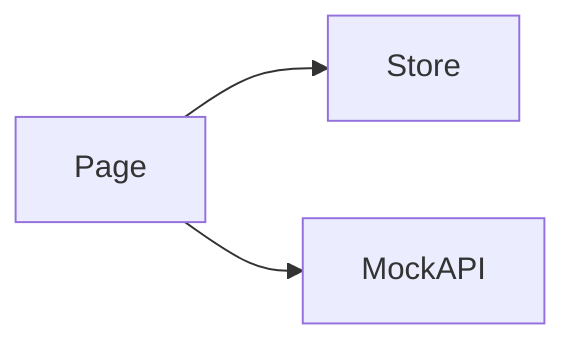

# {{Feature Name}} · Design

> 关注 **HOW**: 在 [requirements.md](./requirements.md) 确认的目标下, 如何在代码中落地。

## 架构概览 · Architecture
TODO: 文字描述 + 可选 mermaid 图。



## 路由 · Routes
| Path | Page Component | 说明 · Note |
|---|---|---|
| `/{{feature-key}}` | `XxxPage` | TODO |

注册位置: `src/features/{{feature-key}}/routes.tsx`,导出 `RouteObject[]`,由 `src/app/router.tsx` 组合。

## 数据模型 · Data Model
```ts
export interface Xxx {
  id: string;
  // TODO
}
```

## Mock API · Endpoints
| Method | Path | Response | 说明 |
|---|---|---|---|
| GET | `/api/{{feature-key}}/xxx` | `Xxx[]` | TODO |

注册位置: `src/features/{{feature-key}}/api/mock.ts` 中 `registerMockRoute(method, path, handler)`。`routes.tsx` 通过 `import "./api/mock"` 触发副作用注册。

## 状态管理 · State (Zustand)
```ts
interface XxxState {
  // TODO
}
```
- 持久化键 · persisted key: `data-agent.{{feature-key}}` (如需 `persist` middleware)。

## 组件分解 · Component Tree
- `XxxPage`
  - `XxxHeader`
  - `XxxBody`
    - TODO

## 交互细节 · Interaction Details
- TODO 键盘 / 鼠标 / 触摸 的关键路径
- TODO 加载态 / 空态 / 错误态

## i18n · Namespaces
- 命名空间: `{{feature-key}}`
- 文件: `src/features/{{feature-key}}/locales/{zh-CN,en-US}.json`
- 注册位置: `src/lib/i18n.ts` 中追加到 `resources` 与 `ns` 列表
- 关键 key:
  - `title` / `subtitle`
  - TODO

## 性能与可观测性 · Performance & Observability
- TODO 首屏渲染预算
- TODO 虚拟化 / 分页策略
- TODO 埋点 / 日志

## 开放问题 · Open Questions
- ❓ TODO
