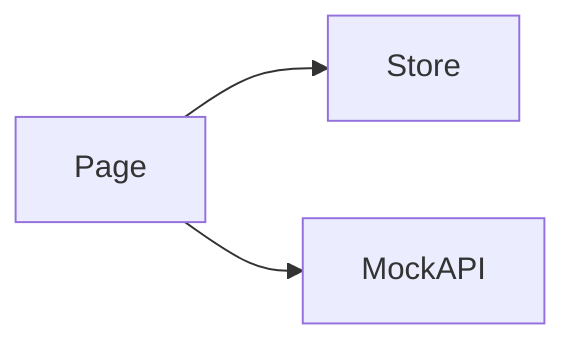

# Agents · Design

> 关注 **HOW**: 在 [requirements.md](./requirements.md) 确认的目标下, 如何在代码中落地。

## 架构概览 · Architecture
TODO



## 路由 · Routes
| Path | Page Component | 说明 |
|---|---|---|
| `/agents` | `AgentsPage` | TODO 列表 |
| `/agents/:id` | `AgentDetailPage` | TODO 详情 (P1) |
| `/agents/new` | `AgentNewPage` | TODO 创建 (P1) |

注册位置: `src/features/agents/routes.tsx`, 当前仅占位 `ModulePlaceholder`。

## 数据模型 · Data Model
```ts
// TODO
// export interface Agent {
//   id: string;
//   name: string;
//   role: string;       // 自由文本或受控枚举
//   status: "idle" | "running" | "error";
//   skills: string[];   // 技能 id 列表
//   lastRunAt?: string;
// }
```

## Mock API · Endpoints
| Method | Path | Response | 说明 |
|---|---|---|---|
| GET | `/api/agents/list` | `Agent[]` | TODO |
| GET | `/api/agents/:id` | `Agent` | TODO |
| POST | `/api/agents/:id/trigger` | `{ runId: string }` | TODO |

注册位置: `src/features/agents/api/mock.ts`。

## 状态管理 · State (Zustand)
```ts
// TODO
interface AgentsState {
  selectedAgentId: string | null;
}
```
- 持久化键: 无

## 组件分解 · Component Tree
- `AgentsPage`
  - `AgentList`
  - `AgentDetail` (drawer / split-pane)
- `AgentNewPage` (P1)

## 交互细节 · Interaction Details
- TODO 触发反馈: toast + 运行状态徽标更新
- TODO 错误态: 显示失败原因 + 重试按钮

## i18n · Namespaces
- 命名空间: `agents`
- 文件: `src/features/agents/locales/{zh-CN,en-US}.json`
- 关键 key: TODO

## 性能与可观测性 · Performance & Observability
- 状态刷新策略: 轮询 vs SSE/WebSocket (待定)
- TODO

## 开放问题 · Open Questions
- ❓ Agent 配置表单是否动态 (基于 skill 注册声明) 渲染
- ❓ 与 `workflow` 模块的状态同步如何实现
