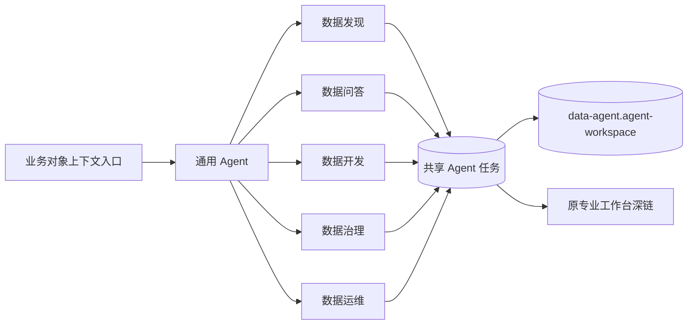

# Data Agent · Design

> 关注 **HOW**：以共享任务模型、六种专业工作区和 SQLite mock 案例实现一级智能任务入口。

## 架构概览 · Architecture

`data-agent` 是独立 feature，但不拥有资产、标准、开发、治理或运行事实。它通过稳定 `contextRefs` 引用其他产品域，并使用共享组件生成深链；其他 feature 不直接 import `data-agent`，上下文入口使用提升到 `src/components/data-platform/` 的共享链接组件。



## 路由 · Routes

| Path | Page Component | 说明 · Note |
|---|---|---|
| `/data-agent` | `Navigate` | 默认进入 `/data-agent/general` |
| `/data-agent/general` | `AgentHomePage` | 通用 Agent 任务 List 与案例入口 |
| `/data-agent/general/tasks/:taskId` | `GeneralTaskPage` | 意图、路由、协作与汇总 |
| `/data-agent/discovery` | `AgentHomePage` | 数据发现任务 List 与案例入口 |
| `/data-agent/discovery/tasks/:taskId` | `DiscoveryTaskPage` | 资产候选、对比与证据 |
| `/data-agent/qa` | `AgentHomePage` | 数据问答任务 List 与案例入口 |
| `/data-agent/qa/tasks/:taskId` | `QaTaskPage` | 回答、图表、口径与来源 |
| `/data-agent/development` | `AgentHomePage` | 数据开发任务 List 与案例入口 |
| `/data-agent/development/tasks/:taskId` | `DevelopmentTaskPage` | 产物、差异、校验与试运行 |
| `/data-agent/governance` | `AgentHomePage` | 数据治理任务 List 与案例入口 |
| `/data-agent/governance/tasks/:taskId` | `GovernanceTaskPage` | 问题、影响、整改与审批 |
| `/data-agent/operations` | `AgentHomePage` | 数据运维任务 List 与案例入口 |
| `/data-agent/operations/tasks/:taskId` | `OperationsTaskPage` | 拓扑、时间线、根因与恢复 |

注册位置：`src/features/data-agent/routes.tsx`，由 `src/app/router.tsx` 组合。详情路由以当前 Agent 作为视角，同一个共享任务 ID 可以在多个 Agent 详情路由中出现。

## 页面信息架构 · Page Information Architecture

| Page / Route | 核心用户任务 | 主结构 | 关键决策信息 | 与相邻页面的布局差异 |
|---|---|---|---|---|
| 六个 Agent 首页 | 浏览本 Agent 任务并从自然语言或案例创建任务 | 任务 List + 任务输入 + 案例启动区 | 状态、参与 Agent、当前步骤、最近产物 | 首页共享的是同一个“发起/浏览任务”原语；案例文案、建议意图和任务集合按 Agent 变化 |
| 通用 Agent 详情 | 识别意图并确认跨 Agent 路由 | 意图卡 + 协作泳道 + 汇总结果 | 为什么路由、执行顺序、跨域冲突、待确认动作 | 唯一展示多 Agent 编排全景 |
| 数据发现详情 | 在多个资产候选中选择可信数据 | 语义检索 + 候选对比 + 证据检查器 | 语义匹配、质量、安全、血缘、可访问性 | 以候选对象比较为核心，不展示分析图表或代码编辑 |
| 数据问答详情 | 复核业务结论及其计算依据 | 问答记录 + 结论画布 + 图表/口径/引用 | 数值、趋势、口径版本、来源、新鲜度、置信度 | 以结论解释和证据引用为核心 |
| 数据开发详情 | 确认生成的开发产物是否可进入专业编辑 | 需求 brief + 代码/DAG 预览 + 差异/校验 | 输入输出、版本差异、规则校验、试运行、风险 | 以代码和产物版本为核心，提供专业编辑器深链 |
| 数据治理详情 | 决定问题是否成立以及如何整改 | 治理范围 + 问题研判 + 影响图 + 整改审阅 | 标准冲突、质量严重性、责任人、审批边界、证据 | 以问题与责任链为核心，不直接修改治理事实 |
| 数据运维详情 | 从异常定位根因并选择恢复动作 | 链路拓扑 + 运行时间线 + 根因排序 + Runbook | 失败节点、上下游影响、恢复风险、是否回交开发 | 以时序、拓扑和恢复控制为核心 |

任务详情共享 `TaskDetailShell` 的标题、任务切换、参与 Agent、重放和证据原语；六种主工作区分别实现，不通过替换标题和列配置生成整页。

## 数据模型 · Data Model

```ts
export type AgentKey =
  | "general"
  | "discovery"
  | "qa"
  | "development"
  | "governance"
  | "operations";

export type AgentTaskStatus = "running" | "needs-confirmation" | "completed" | "blocked";

export interface AgentTask {
  id: string;
  caseId: string;
  title: string;
  prompt: string;
  summary: string;
  primaryAgent: AgentKey;
  participantAgents: AgentKey[];
  status: AgentTaskStatus;
  progress: number;
  currentStep: string;
  steps: AgentStep[];
  contextRefs: AgentObjectRef[];
  evidence: AgentEvidence[];
  artifacts: AgentArtifact[];
  pendingAction?: AgentPendingAction;
  workspace: AgentWorkspaceData;
  updatedAt: string;
}

export interface DataAgentState {
  tasks: AgentTask[];
  auditTrail: AgentAuditEvent[];
}
```

`participantAgents` 决定任务出现在哪些 Agent 首页。跨 Agent 任务仍只有一个任务对象；视角路由不改变事实所有权。

## 状态与 Mock

- 持久化 scope：`data-agent.agent-workspace`。
- 初始 fixture 包含一个贯穿客户复购率/华东销售异常的共享案例，以及每个 Agent 两个专项案例。
- `replayTask(taskId)` 从只读 fixture 恢复单个任务。
- `resetAllCases()` 恢复所有 fixture，但不修改其他 SQLite scope。
- `advanceTask`、`confirmAction`、候选选择、图表切换和 Runbook 操作均更新 mock 状态与审计记录。
- 自然语言输入按当前 Agent 选择最接近的案例模板克隆新任务；不宣称完成真实推理。

## 组件分解 · Component Tree

- `DataAgentLayout`
  - `DataAgentProvider`
  - `Outlet`
- `AgentHomePage`
  - `AgentHomeHeader`
  - `TaskComposer`
  - `InteractiveCaseGallery`
  - `AgentTaskList`
- `TaskDetailShell`
  - `CollapsibleTaskRail`
  - `TaskHeader`
  - `ParticipantAgentNav`
  - 专业工作区之一
    - `GeneralTaskPage`
    - `DiscoveryTaskPage`
    - `QaTaskPage`
    - `DevelopmentTaskPage`
    - `GovernanceTaskPage`
    - `OperationsTaskPage`
- `DataAgentContextLink`（位于共享 `src/components/data-platform/`）

## 交互细节 · Interaction Details

- 首页自然语言输入支持 Enter 发起，Shift+Enter 换行；提交后克隆匹配案例并进入详情。
- 案例卡支持启动/继续/重新演示；全部恢复需要二次确认。
- 详情页的任务栏可收起，开发与运维工作区默认保留较宽内容区。
- 改变业务状态的 mock 动作必须使用显式确认卡；确认后记录操作者、时间和结果。
- 受控动作只显示“提交至原工作台审批”，不提供“Agent 自动批准”。
- URL query 支持 `contextType`、`contextId`、`intent`，首页将其显示为已接入上下文并建议任务模板。
- 加载中、SQLite 错误、空列表、证据不足、阻塞和完成状态均有明确反馈。

## i18n · Namespaces

- 命名空间：`data-agent`
- 文件：`src/features/data-agent/locales/{zh-CN,en-US}.json`
- 注册位置：`src/lib/i18n.ts`
- 稳定 key：`title`、`agents.*`、`status.*`、`actions.*`、`workspace.*`

## 性能与可观测性 · Performance & Observability

- feature 使用 `React.lazy` 按路由加载；案例 fixture 不包含二进制或大文本。
- 任务 List 首期数据量小，不启用虚拟化；后续真实后端接入时采用服务端分页。
- 每次重放、推进、确认和深链均写入 `auditTrail`，SQLite API 同时保留 `app_events` 写入审计。
- 不记录自然语言思维链，只记录用户输入、可见计划、动作参数摘要和结果引用。

## 开放问题 · Open Questions

- 真实多 Agent 运行时的授权委托、幂等和失败补偿协议留待生产后端设计。
- 真实上下文读取应由统一领域 API 提供，当前原型只消费 fixture 中的稳定引用。
