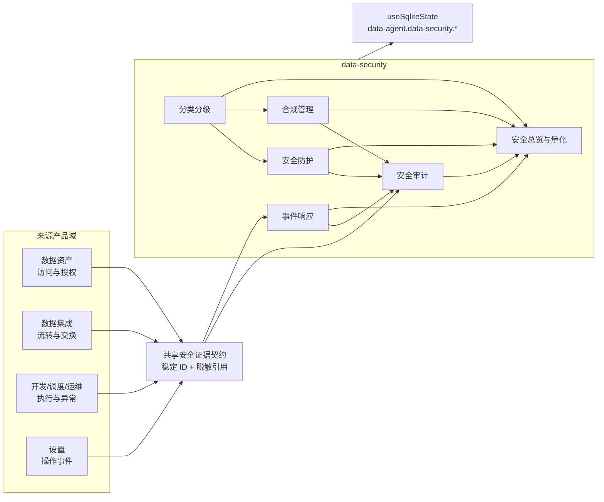

# Data Security · 数据安全设计

> 本文描述 [requirements.md](./requirements.md) 的目标实现。当前代码已实现 25 个功能页、六分域 SQLite mock、确定性执行规则和旧 scope 非破坏迁移；生产连接器与跨 feature 证据注册表仍属后续范围。

## 设计原则 · Principles

1. **就绪度而非认证**：DCMM 控制项、指标和报告用于举证与差距管理，不生成认证结论。
2. **事实归来源域所有**：访问、流转、交换、操作和执行事件由来源模块拥有，安全模块只保存稳定引用。
3. **分类与等级双轴**：多选分类表达“是什么”，单选安全等级表达“影响多大”。
4. **AI 辅助而非代责**：重要数据和核心数据只能由 AI 提议，必须经职责分离审批。
5. **报告不可覆盖**：分类、出境、审计和事件复盘均冻结版本，修订形成新版本。
6. **最少暴露**：不保存原始敏感值、真实密钥、凭证或真实监管材料。
7. **轻量固定流程**：使用固定审批和五阶段事件清单，不建设通用工作流引擎。

## 当前实现信息架构

- 总览页展示 DCMM4 就绪矩阵、指标未知态、证据缺口、组织证据和统一待办。
- 分类识别和脱敏页面已使用专属工作台；其余业务页当前仍有共用台账的过渡实现，后续不得把它作为新页面模板，并应按本文“页面结构”逐页迁移。
- 所有页面不得保存或展示真实敏感值、密钥材料、密码、token 或完整连接串；预览值均为虚构示例。
- 页面可以共享视觉与交互原语，但配置驱动的整页通用工作台不作为目标架构；领域状态仍按六个 scope 隔离。

## 架构概览 · Architecture



feature 之间不得直接 import。跨域证据契约规划放在 `src/lib/security-evidence.ts`，脱敏事件注册表规划放在 `src/stores/securityEvidenceRegistry.ts`；来源 feature 与 `data-security` 都只依赖共享层。

## 菜单层级 · Navigation

### 一级菜单

- `data-security`：数据安全，匹配 `/data-security`。

### 二级分组

二级菜单主要用于分组，不直接承担业务状态；“安全总览”作为二级直达页：

- `data-security.overview`：安全总览直达页。
- `data-security.group.compliance`：数据合规管理。
- `data-security.group.classification`：数据分类分级。
- `data-security.group.protection`：安全防护。
- `data-security.group.audit`：安全审计。
- `data-security.group.incidents`：安全事件响应。

### 三级菜单与路由

| 二级分组 | 三级菜单 / `builtinRouteKey` | 当前路由 | 页面组件 | 状态 |
|---|---|---|---|---|
| 安全总览 | `data-security.overview` | `/data-security/overview` | `SecurityOverviewPage` | SQLite mock 已实现 |
| 数据合规 | `data-security.compliance` | `/data-security/compliance` | `ComplianceChecklistPage` | SQLite mock 已实现 |
| 数据合规 | `data-security.compliance-reviews` | `/data-security/compliance/reviews` | `ComplianceReviewsPage` | SQLite mock 已实现 |
| 数据合规 | `data-security.personal-information` | `/data-security/compliance/personal-information` | `PersonalInformationPage` | SQLite mock 已实现 |
| 数据合规 | `data-security.important-data` | `/data-security/compliance/important-data` | `ImportantDataPage` | SQLite mock 已实现 |
| 数据合规 | `data-security.cross-border` | `/data-security/cross-border` | `CrossBorderAssessmentPage` | SQLite mock 已实现 |
| 分类分级 | `data-security.classification` | `/data-security/classification` | `ClassificationPage` | SQLite mock 已实现 |
| 分类分级 | `data-security.classification-reviews` | `/data-security/classification/reviews` | `ClassificationReviewsPage` | SQLite mock 已实现 |
| 分类分级 | `data-security.classification-rules` | `/data-security/classification/rules` | `ClassificationRulesPage` | SQLite mock 已实现 |
| 分类分级 | `data-security.classification-reports` | `/data-security/classification/reports` | `ClassificationReportsPage` | SQLite mock 已实现 |
| 安全防护 | `data-security.protection` | `/data-security/protection` | `ProtectionPoliciesPage` | SQLite mock 已实现 |
| 安全防护 | `data-security.access-control` | `/data-security/access-control` | `AccessControlPage` | SQLite mock 已实现 |
| 安全防护 | `data-security.masking` | `/data-security/masking` | `MaskingPage` | SQLite mock 已实现 |
| 安全防护 | `data-security.encryption` | `/data-security/encryption` | `EncryptionPage` | SQLite mock 已实现 |
| 安全防护 | `data-security.watermark` | `/data-security/watermark` | `WatermarkPage` | SQLite mock 已实现 |
| 安全防护 | `data-security.risk` | `/data-security/risk` | `SecurityRiskPage` | SQLite mock 已实现 |
| 安全审计 | `data-security.audit` | `/data-security/audit` | `AuditPlansPage` | SQLite mock 已实现 |
| 安全审计 | `data-security.audit-executions` | `/data-security/audit/executions` | `AuditExecutionsPage` | SQLite mock 已实现 |
| 安全审计 | `data-security.audit-evidence` | `/data-security/audit/evidence` | `AuditEvidencePage` | SQLite mock 已实现 |
| 安全审计 | `data-security.audit-reports` | `/data-security/audit/reports` | `AuditReportsPage` | SQLite mock 已实现 |
| 安全审计 | `data-security.audit-findings` | `/data-security/audit/findings` | `AuditFindingsPage` | SQLite mock 已实现 |
| 事件响应 | `data-security.incidents` | `/data-security/incidents` | `IncidentsPage` | SQLite mock 已实现 |
| 事件响应 | `data-security.incident-sop` | `/data-security/incidents/sop` | `IncidentSopPage` | SQLite mock 已实现 |
| 事件响应 | `data-security.incident-notifications` | `/data-security/incidents/notifications` | `IncidentNotificationsPage` | SQLite mock 已实现 |
| 事件响应 | `data-security.incident-drills` | `/data-security/incidents/drills` | `IncidentDrillsPage` | SQLite mock 已实现 |

当前 `/data-security` 重定向到 `/overview`。现有 `data-security.classification` 与 `data-security.masking` 的稳定菜单 key 和路径未更名。

## 页面结构 · Page Structure

数据安全页面禁止统一套用“顶部指标卡 + 下方列表”的通用壳。指标仅用于安全总览，以及确有量化决策需求的局部区域；业务页必须按用户任务选择结构：

| 页面 | 核心任务 | 主结构 | 关键决策信息 | 与同模块页面的差异 |
|---|---|---|---|---|
| 安全总览 | 判断整体举证就绪度 | 指标、缺口与待办驾驶舱 | 就绪度、未知值、证据缺口 | 唯一以跨域指标为主体的页面 |
| 合规清单、防护策略、审计证据 | 横向比较控制覆盖 | 全宽控制矩阵 + 详情抽屉 | 适用范围、控制项、证据状态 | 主画布不常驻目录栏和检查栏 |
| 个人信息、加密 | 沿生命周期或加密层检查配置 | 对象目录 + 业务过程双栏，下方证据区 | 处理环节、算法层、密钥引用、影响评估 | 用过程链替代控制矩阵 |
| 访问控制 | 联合判断主体、对象和用途 | 策略 / 权限矩阵 / 模拟结果三栏 | 主体、对象、目的、期限、配额 | 三栏分别承担策略选择、关系判断和模拟验证 |
| 分类识别 | 配置扫描并复核识别结果 | 分类体系 + 识别任务 + 判断配置三栏 | 范围、规则版本、置信度、等级候选 | 三栏对应稳定的分类导航、批量任务和单项配置 |
| 分类规则 | 编辑版本化规则和发布门禁 | 版本目录 + 规则编辑器双栏 | 命中逻辑、阈值、适用范围、发布条件 | 不再常驻第三个检查栏 |
| 脱敏 | 配置策略并对比处理效果 | 策略目录 + 预览工作台双栏 | 原值边界、脱敏方式、适用范围、覆盖字段 | 以处理前后预览为主体 |
| 合规审查、重要数据、分类复核、风险、审计整改 | 推进职责分离和整改 | 分阶段审批看板 + 下方档案 | 当前责任人、审批阶段、证据与整改状态 | 列表示业务阶段，不是主从详情栏 |
| 出境评估 | 按顺序完成事实判断和路径建议 | 顶部步骤条 + 主表单 / 风险摘要双栏 | 数据类型、规模、接收方、建议路径、材料缺口 | 步骤顺序高于对象目录 |
| 水印 | 配置并验证水印效果 | 配置与效果预览 / 追踪验证双栏 | 模板、追踪号、提取结果、来源证据 | 以可视预览和追踪验证为主体 |
| 事件 SOP | 编制五阶段响应模板 | 版本章节目录 + SOP 编辑器双栏 | 触发条件、角色、动作、退出标准 | 采用文档编辑结构，不使用流程三栏 |
| 事件通知 | 判断义务并记录实际通知 | 顶部义务时间轴 + 清单 / 判断记录双栏 | 法源、时限、审批、实际发送记录 | 时间关系在页面顶部持续可见 |
| 分类报告、审计报告 | 编制、复核并冻结正式成果 | 版本导航 + 文档画布双栏，门禁位于画布下方 | 范围、规则版本、证据限制、审批 | 文档画布占据主要宽度 |
| 审计计划 | 编制范围、团队、抽样和排期 | 全宽日历排期 + 下方启动门禁 | 执行窗口、范围、团队、抽样 | 以时间计划为主体 |
| 审计执行 | 逐项执行并形成底稿 | 检查表 / 工作底稿双栏 | 执行结果、证据引用、发现候选 | 以检查动作和取证并行为主体 |
| 事件演练 | 运行场景并完成复盘 | 全宽演练时间线 + 执行 / 复盘双区 | 注入时间、响应结果、改进项 | 强调时序及复盘，不复用审计日程 |
| 事件台账 | 指挥真实事件的五阶段处置 | 事件队列 / 时间线 / 关闭门禁三栏 | 严重性、当前阶段、处置证据、关闭条件 | 三栏对应队列、指挥过程和独立关闭验证 |

固定左中右三栏仅允许用于分类识别、访问控制和事件台账，因为三列分别承载不可合并的稳定任务上下文。其他页面不得为了复用壳而增加目录栏、主画布和检查栏。同一组页面可以复用交互原语，但不得仅替换标题、指标和表格列来伪装成不同功能。

### 安全总览

- `ReadinessMatrix`：三域及控制项状态。
- `SecurityMetricGrid`：指标目标、实际、趋势和未知状态。
- `EvidenceGapPanel`：证据缺口、来源失败和处理人。
- `SecurityWorkQueue`：分类复核、出境重评、审计整改和重大事件待办。
- `OrganizationEvidencePanel`：制度、培训、演练、外部评估和标准参与证据。

### 数据合规管理

- 合规清单页：规则包、适用性、控制项和证据映射。
- 合规审查页：审查表单、检查清单、风险、建议和整改。
- 个人信息页：处理活动、依据、影响评估和接收方证据。
- 重要数据页：候选、依据、双人批准、申报和保护记录。
- 出境评估页：场景表单、路径建议、材料缺口、审批和报告版本。

### 数据分类分级

- 识别任务页：任务、范围、进度、覆盖和识别结果。
- 复核审批页：低置信度、冲突、抽样和重要/核心候选队列。
- 规则页：分类目录、等级规则、识别规则、模型和依据版本。
- 报告页：版本列表、差异、影响、审批和导出。

### 安全防护

- 防护策略页：等级到控制基线映射、例外和覆盖率。
- 访问控制页：主体、对象、目的、期限、配额和模拟校验。
- 脱敏页：静态/动态规则、脱敏样例、执行与例外。
- 加密页：传输/存储/字段级策略、密钥引用和轮换证据。
- 水印页：显式/隐式策略、模拟嵌入、验证和追踪。
- 监控与风险页：监控规则、安全信号、风险清单和评估报告。

### 安全审计

- 审计计划页：类型、范围、期间、团队、抽样和内外部关联。
- 审计执行页：检查表、工作记录、证据、发现和建议。
- 审计证据页：来源域引用、校验、采集和证据缺口。
- 审计报告页：一键草稿、复核、批准、版本和导出。
- 问题整改页：责任人、期限、整改证据、复核和关闭。

### 事件响应

- 事件台账页：信号、疑似事件、事件、严重性、时间线和五阶段状态。
- SOP 页：五阶段轻量模板、版本和停用。
- 通知页：义务、法源、路径建议、时限、审批和实际记录。
- 演练与复盘页：计划、结果、问题、改进和知识库。

## 数据模型 · Data Model

### 通用类型

```ts
type RecordStatus = "draft" | "pending_review" | "approved" | "effective" | "expired" | "closed";
type EvidenceState = "valid" | "missing" | "collection_failed" | "unverifiable" | "preserved";

interface VersionRef {
  id: string;
  version: number;
}

interface SecurityEvidenceRef {
  id: string;
  type: "policy" | "access" | "flow" | "exchange" | "operation" | "execution" | "document";
  sourceDomain: string;
  sourceRecordId: string;
  periodStart?: string;
  periodEnd?: string;
  maskedReference: string;
  checksum?: string;
  state: EvidenceState;
  preserved: boolean;
  createdAt: string;
}

interface ApprovalRecord {
  id: string;
  step: string;
  actorRole: string;
  actorId: string;
  action: "approve" | "reject" | "return";
  opinion?: string;
  actedAt: string;
}
```

### 规则、就绪度与指标

```ts
interface ComplianceRulePack {
  id: string;
  name: string;
  jurisdiction: "CN" | string;
  authority: string;
  sourceUrl: string;
  version: string;
  effectiveFrom: string;
  effectiveUntil?: string;
  supersedesId?: string;
  status: "draft" | "effective" | "superseded" | "expired";
}

interface ReadinessControl {
  id: string;
  dcmmRef: string;
  domain: "compliance" | "protection" | "audit";
  applicable: boolean | null;
  state: "not_applicable" | "insufficient_evidence" | "needs_improvement" | "ready";
  owner: string;
  evidenceIds: string[];
  gapIds: string[];
}

interface SecurityMetricDefinition {
  id: string;
  name: string;
  formula: string;
  numeratorDefinition?: string;
  denominatorDefinition?: string;
  sourceTypes: string[];
  period: "monthly" | "quarterly" | "annual";
  target?: number;
  warningThreshold?: number;
  owner: string;
  ruleVersion: string;
}

interface SecurityMetricResult {
  definitionId: string;
  periodStart: string;
  periodEnd: string;
  value: number | null;
  state: "normal" | "warning" | "unknown";
  evidenceIds: string[];
  reason?: string;
}
```

### 分类分级

```ts
type DataCategory =
  | "personal_information"
  | "sensitive_personal_information"
  | "operations"
  | "finance"
  | "research"
  | "trade_secret"
  | string;

type RegulatoryLevel = "general_regular" | "general_sensitive" | "important" | "core";

interface DataItemRef {
  id: string;
  assetId: string;
  assetVersion: number;
  kind: "column" | "path" | "api_field" | "content_region";
  locator: string;
  maskedName: string;
}

interface ClassificationFinding {
  id: string;
  taskId: string;
  dataItem: DataItemRef;
  proposedCategories: DataCategory[];
  proposedLevel: RegulatoryLevel;
  confidence: number;
  modelVersion?: string;
  ruleVersion: string;
  evidenceIds: string[];
  conflicts: string[];
  status: "candidate" | "auto_effective" | "pending_review" | "approved" | "rejected";
}

interface EffectiveClassificationRecord {
  id: string;
  dataItem: DataItemRef;
  categories: DataCategory[];
  level: RegulatoryLevel;
  effectiveFrom: string;
  effectiveUntil?: string;
  basis: string;
  findingId: string;
  approvals: ApprovalRecord[];
  version: number;
}

interface ClassificationReport {
  id: string;
  version: number;
  scopeSnapshot: DataItemRef[];
  rulePackRefs: VersionRef[];
  modelVersion?: string;
  coverage: number | null;
  excludedItems: string[];
  findingIds: string[];
  impactRefs: string[];
  status: "draft" | "pending_review" | "approved" | "invalidated";
  approvals: ApprovalRecord[];
}
```

现有页面中的“重要数据”分类标签和 `L1–L4` 等级不迁移为生效结论。迁移时将其标记为 `legacy_pending_review`，由用户映射到新分类和等级后形成新版本。

### 保护策略

```ts
type ProtectionPolicyType = "access" | "masking" | "encryption" | "watermark" | "monitoring";

interface ProtectionPolicy {
  id: string;
  type: ProtectionPolicyType;
  name: string;
  classificationRefs: VersionRef[];
  assetIds: string[];
  scenario: string;
  owner: string;
  config: MaskingConfig | EncryptionConfig | WatermarkConfig | Record<string, unknown>;
  status: "draft" | "pending_approval" | "effective" | "suspended" | "expired";
  version: number;
  approvals: ApprovalRecord[];
}

interface MaskingConfig {
  mode: "static" | "dynamic";
  method: "mask" | "generalize" | "replace" | "hash" | "tokenize";
  maskedPreview?: string;
}

interface EncryptionConfig {
  layer: "transit" | "storage" | "field";
  algorithm: string;
  keyReference: string;
  rotationState: "current" | "due" | "overdue";
}

interface WatermarkConfig {
  mode: "visible" | "invisible_trace";
  template: string;
  trackingFields: Array<"user" | "authorization" | "purpose" | "time" | "trace_id">;
}

interface PolicyExecution {
  id: string;
  policyRef: VersionRef;
  targetRef: string;
  status: "pending" | "running" | "success" | "failed" | "stopped";
  mock: true;
  resultSummary: string;
  evidenceIds: string[];
  executedAt?: string;
}
```

### 出境评估

```ts
type CrossBorderPath =
  | "insufficient_information"
  | "possible_exemption"
  | "standard_contract_or_certification"
  | "security_assessment"
  | "expert_review";

interface CrossBorderScenario {
  id: string;
  name: string;
  domesticProcessor: string;
  criticalInfrastructureOperator: boolean | null;
  purpose: string;
  necessity: string;
  assetRefs: VersionRef[];
  recipient: string;
  recipientCountry: string;
  subprocessors: string[];
  onwardTransfer: string;
  channel: string;
  frequency: string;
  startAt: string;
  endAt?: string;
  annualPersonalCount: number | null;
  annualSensitivePersonalCount: number | null;
  safeguards: string[];
  evidenceIds: string[];
  version: number;
}

interface CrossBorderAssessment {
  id: string;
  scenarioRef: VersionRef;
  rulePackRefs: VersionRef[];
  suggestedPath: CrossBorderPath;
  matchedRules: string[];
  missingFacts: string[];
  risks: string[];
  materialGaps: string[];
  status: "draft" | "pending_legal" | "pending_security" | "internally_approved" | "reassessment_required";
  approvals: ApprovalRecord[];
  version: number;
}
```

“内部批准”只表示内部流程完成，不允许命名为 `regulatory_approved` 或“合规通过”。

### 安全审计

```ts
type AuditType = "process" | "standards" | "compliance" | "supplier";

interface SecurityAuditPlan {
  id: string;
  name: string;
  types: AuditType[];
  scope: string[];
  periodStart: string;
  periodEnd: string;
  internalTeam: string[];
  externalAssessmentRef?: string;
  samplingStrategy: string;
  status: "draft" | "scheduled" | "in_progress" | "completed" | "cancelled";
}

interface AuditFinding {
  id: string;
  auditId: string;
  severity: "critical" | "high" | "medium" | "low";
  title: string;
  evidenceIds: string[];
  businessImpact: string;
  economicImpact?: string;
  rootCause: string;
  recommendation: string;
  owner: string;
  dueAt: string;
  status: "open" | "remediating" | "pending_verification" | "closed";
  verifiedBy?: string;
}

interface SecurityAuditReport {
  id: string;
  auditId: string;
  version: number;
  evidenceManifest: SecurityEvidenceRef[];
  evidenceCompleteness: number | null;
  limitations: string[];
  findings: string[];
  businessImpact: string;
  economicImpact?: string;
  rootCauses: string[];
  recommendations: string[];
  status: "draft" | "pending_review" | "approved" | "supplemented";
  approvals: ApprovalRecord[];
}
```

### 安全事件

```ts
interface SecuritySignal {
  id: string;
  sourceDomain: string;
  sourceRecordId: string;
  ruleId: string;
  observedAt: string;
  summary: string;
  status: "new" | "linked" | "dismissed";
}

type IncidentSeverity = "S1" | "S2" | "S3" | "S4";
type IncidentPhase = "triage" | "response" | "recovery" | "notification" | "review";

interface SecurityIncident {
  id: string;
  title: string;
  signalIds: string[];
  severity: IncidentSeverity;
  affectedAssetIds: string[];
  owner: string;
  currentPhase: IncidentPhase;
  status: "suspected" | "confirmed" | "in_progress" | "pending_verification" | "closed" | "dismissed";
  firstObservedAt: string;
  confirmedAt?: string;
  recoveredAt?: string;
  reviewCompletedAt?: string;
  evidenceIds: string[];
  closureVerifiedBy?: string;
}

interface IncidentChecklistItem {
  id: string;
  incidentId: string;
  phase: IncidentPhase;
  owner: string;
  status: "todo" | "doing" | "done" | "skipped";
  result?: string;
  attachmentRefs: string[];
  completedAt?: string;
}

interface NotificationObligation {
  id: string;
  incidentId: string;
  audience: "internal" | "regulator" | "individual_or_customer" | "partner";
  rulePackRef: VersionRef;
  decision: "required" | "not_required" | "pending_legal";
  dueAt?: string;
  approvedBy?: string;
  notifiedAt?: string;
  delayReason?: string;
  mock: true;
}
```

## 关键规则 · Business Rules

### 分类自动生效

```text
普通分类候选
  ├─ 高置信度 + 无冲突 + 确定性规则命中 → 自动生效 + 抽样复核
  └─ 低置信度或冲突 → 人工复核

重要/核心数据候选
  └─ 数据负责人确认 → 数据安全负责人批准 → 生效
```

置信度阈值是版本化配置，不硬编码为国标门槛。确定性 mock 使用稳定输入生成可重复结果，不能随机改变同一任务结论。

### 资产等级聚合

1. 读取资产全部生效数据项等级。
2. 默认取最高等级。
3. 应用规模、精度、覆盖度、关联性和场景组合规则，只允许建议升级。
4. 降级必须新建评估和审批，不允许算法自动降级。

### 指标未知值

当应统计范围、分母或证据不完整时，计算函数返回 `null` 并附原因；UI 展示“未知/证据不足”，不得使用 `0`。

### 出境路径建议

1. 先检查关键事实是否完整。
2. 固定引用当时有效规则包。
3. 依次评估豁免、标准合同/认证、安全评估和专家审查条件。
4. 输出建议、命中规则、缺口和风险，不输出法律保证。
5. 法务合规与数据安全双重审批后形成内部决定。

### 审计报告生成

```text
审计计划
  → 冻结范围与期间
  → 汇聚来源域证据引用
  → 校验完整性并登记证据缺口
  → 计算指标、聚类异常、生成根因候选
  → 生成草稿
  → 审计人员复核
  → 批准并冻结版本
```

一键生成不得绕过复核。外部报告只作为证据引用，不能由原型生成。

### 安全事件关闭

- 疑似事件允许标记已排除，但必须保留依据。
- S1/S2 必须完成复盘并由非处置人复核。
- 紧急处置允许先执行，之后补录原因、执行人和授权。
- 通知任务由规则生成建议，最终由法务合规确认。

## 状态持久化 · SQLite State

目标按二级能力拆分 scope，降低大型 JSON 并发写入冲突：

| Scope | 内容 |
|---|---|
| `data-agent.data-security.overview` | 就绪度、指标定义/结果、组织证据和待办 |
| `data-agent.data-security.compliance` | 规则包、清单、审查、个人信息、重要数据和出境评估 |
| `data-agent.data-security.classification` | 任务、候选、生效记录、规则和报告；沿用当前 scope |
| `data-agent.data-security.protection` | 防护、访问、脱敏、加密、水印、监控和风险 |
| `data-agent.data-security.audit` | 计划、执行、证据目录、报告和整改 |
| `data-agent.data-security.incidents` | 信号、事件、SOP、通知、演练和复盘 |

当前 `data-agent.data-security.masking` 作为旧版只读迁移来源。首次进入新版保护模块时复制为带 `legacySourceId` 的脱敏草稿，不删除旧 scope；迁移成功后新写入统一进入 `data-agent.data-security.protection`。

每个 scope 根对象包含 `schemaVersion`、`updatedAt` 和领域数组。写入统一通过 `useSqliteState`，页面不得直接 `fetch` SQLite API。

## 模拟执行 · Mock Execution

- 分类识别、策略应用、出境评估、审计报告生成和水印验证使用确定性纯函数与短时异步状态模拟。
- 同一输入、规则版本和模型版本重复执行应得到同一结论。
- 每类任务覆盖“待运行、运行中、成功、部分成功、失败、已停止”。
- 失败记录脱敏错误原因和可重试范围；已成功对象不得重复创建版本。
- 所有执行结果带 `mock: true`，UI 显示原型说明。

## 报告与证据包 · Reports

分类、出境和审计报告共用以下生成约束：

- 草稿可以更新；待复核后仅能退回或批准。
- 已批准报告不可覆盖，修订增加版本号。
- 报告固定规则包、模型、对象和证据版本。
- 导出内容包含摘要、范围、指标口径、结论、限制、证据清单和审批记录。
- 当前原型只模拟导出结果，不生成具有认证或监管效力的材料。

## 跨模块集成 · Integration

| 来源 / 消费方 | 共享契约 |
|---|---|
| 数据资产 | 稳定资产/字段 ID、资产版本、使用授权、访问事件、产品安全待复核状态 |
| 数据集成 | 流转和交换事件、来源/目标、渠道、结果、追踪 ID |
| 数据开发与调度 | 任务/作业执行事件、运行人、输入输出资产引用和结果 |
| 运维监控 | 异常信号、资源或链路事件引用 |
| 设置 | 操作事件和脱敏主体标识 |

来源域只向共享注册表提供脱敏事件摘要和稳定引用。安全模块不得通过 feature 直接 import 读取内部状态。

## 交互与视觉 · UX

- 遵循 Classic Light SaaS：白色面板、蓝色主色、紧凑表格和明确状态反馈。
- 一级菜单“数据安全”展开六个二级分组；二级分组展开三级页面。
- 各页保持标题、操作反馈和视觉语言一致，但主结构必须由控制配置、审批、评估、取证、报告或事件处置等具体任务决定，不统一套用指标、筛选、表格和详情抽屉的固定层级。
- 高风险动作显示影响范围、版本、审批要求和 mock 边界。
- 详情优先展示证据和限制，避免只显示绿色状态。
- 列表支持搜索、状态、责任人、等级、时间和规则版本筛选；大列表使用分页。
- 加载、空数据、失败、运行中、成功和已停止状态均有可见反馈。

## i18n

- 命名空间：`data-security`。
- 目标文件：`src/features/data-security/locales/{zh-CN,en-US}.json`。
- 稳定 key 按 `overview`、`compliance`、`classification`、`protection`、`audit`、`incidents` 分组。
- 标准名称、法规名称和状态文案不得只写在页面组件中。

## 安全与隐私 · Security

- 表单禁止真实密码、token、密钥、私钥和完整连接串。
- 分类识别证据只保存脱敏示例和统计特征。
- 审计报告不复制 API 响应、文件内容或原始敏感参数。
- 水印追踪只保存模拟标识和关联 ID，不生成真实可识别数据副本。
- 身份只保存脱敏名称或稳定 ID，不保存认证凭证。

## 性能与可观测性 · Performance

- 列表默认分页，证据和事件时间线按需加载。
- 指标计算使用 memoized selector 或纯函数，不在渲染循环中重复全量扫描。
- 报告生成展示任务进度和分阶段结果；来源缺口不阻塞草稿生成，但限制结论。
- 重要模拟动作写入 SQLite `app_events` 并带 scope、对象 ID、动作和结果，不复制业务敏感内容。

## 实现迁移顺序 · Migration

1. 保留现有 `/classification` 和 `/masking` 路由及菜单 key。
2. 引入新的双轴分类模型，将旧记录标记待映射，不自动当作生效结论。
3. 将旧脱敏记录复制为新版保护策略草稿，加密说明拆到独立加密策略。
4. 先实现安全总览、合规/出境、分类分级和安全审计的 P0 证据闭环。
5. 再实现访问控制、加密、水印、监控风险和事件响应。
6. 所有目标页面完成后再把 `/data-security` 默认入口改为 `/overview`，同步菜单和当前路由文档。

## 决策记录 · ADR

- [ADR-0009：DCMM 就绪度而非认证结论](../../adr/0009-dcmm-readiness-not-certification.md)
- [ADR-0010：AI 只提议重要数据和核心数据等级](../../adr/0010-ai-proposes-regulated-data-levels.md)
- [ADR-0011：安全审计引用来源域证据](../../adr/0011-security-audit-references-source-evidence.md)
