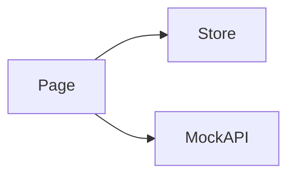

# Data Sources · Design

> 关注 **HOW**: 在 [requirements.md](./requirements.md) 确认的目标下, 如何在代码中落地。

## 架构概览 · Architecture
TODO



## 路由 · Routes
| Path | Page Component | 说明 |
|---|---|---|
| `/data-source` | `DataSourcePage` | TODO 列表入口 |
| `/data-source/:id` | `DataSourceDetailPage` | TODO 详情 (P1) |

注册位置: `src/features/data-source/routes.tsx`, 当前仅占位 `ModulePlaceholder`。

## 数据模型 · Data Model
```ts
// TODO 示例
// export interface DataSource {
//   id: string;
//   name: string;
//   type: "postgres" | "mysql" | "s3" | "kafka" | "http" | "file";
//   status: "online" | "offline" | "degraded";
//   lastSyncAt: string;
// }
```

## Mock API · Endpoints
| Method | Path | Response | 说明 |
|---|---|---|---|
| GET | `/api/data-source/list` | `DataSource[]` | TODO |
| GET | `/api/data-source/:id` | `DataSource` | TODO |
| GET | `/api/data-source/:id/schema` | `SchemaPreview` | TODO |

注册位置: `src/features/data-source/api/mock.ts`。

## 状态管理 · State (Zustand)
```ts
// TODO
interface DataSourceState {
  selectedId: string | null;
}
```
- 持久化键: 无 (会话级)

## 组件分解 · Component Tree
- `DataSourcePage`
  - `ConnectorList`
  - `ConnectorDetailDrawer`

## 交互细节 · Interaction Details
- TODO 列表筛选 (按 type / status)
- TODO 凭证字段一律遮罩, 不通过前端明文展示

## i18n · Namespaces
- 命名空间: `data-source`
- 文件: `src/features/data-source/locales/{zh-CN,en-US}.json`
- 关键 key: TODO

## 性能与可观测性 · Performance & Observability
- 列表分页或虚拟化 (条目 ≥ 100 时)
- TODO

## 开放问题 · Open Questions
- ❓ TODO
