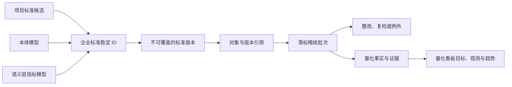

# Data Standard · Design

## 设计状态 · Design Status

本文描述 `data-standard` feature 的目标设计。当前工作区尚未实现对应菜单、路由、页面和状态；实现必须以本设计和 [requirements.md](./requirements.md) 为准。

## 设计原则 · Principles

- 数据标准是独立一级产品域，五项能力各有独立二级路由和专属工作台。
- 本体模型和语义层指标模型由数据标准域权威维护，其他 feature 只保存稳定引用。
- AI 负责候选发现、归并、比对和低风险自动化；正式业务事实仍由责任链批准。
- 已发布标准不可覆盖，版本只提供清晰的查看、差异和引用追溯，不建设复杂版本状态机。
- 稽核结果、AI 决策、整改证据和量化事实均可追溯到当时使用的版本。
- 页面结构围绕各能力的核心决策设计，不复用“指标卡 + 筛选栏 + CRUD 表格”的整页模板。

## 路由与菜单 · Routes and Navigation

| 稳定路由 key | 菜单名称 | 目标路由 | 页面定位 |
|---|---|---|---|
| `data-standard.business-terms` | 业务术语 | `/data-standard/business-terms` | 术语与本体语义工作台 |
| `data-standard.master-data` | 主数据 | `/data-standard/master-data` | 主数据匹配与黄金记录工作台 |
| `data-standard.reference-data` | 参考数据 | `/data-standard/reference-data` | 代码集、版本与映射工作台 |
| `data-standard.data-element-standards` | 数据元标准 | `/data-standard/data-element-standards` | 数据元目录与自动落标工作台 |
| `data-standard.metric-dictionary` | 指标字典 | `/data-standard/metric-dictionary` | 指标口径、语义模型与一致性工作台 |

原 `/data-governance/standards` 和旧菜单 key 删除，不增加兼容重定向。目标路由只有在页面、mock 数据和持久化状态实现后才能登记为已上线。

## 页面信息架构 · Page Information Architecture

| 页面 | 核心任务 | 主结构 | 关键决策信息 | 与其他页面的差异 |
|---|---|---|---|---|
| 业务术语 | 将项目术语归并为统一业务概念 | 左侧术语目录；中央本体关系图；右侧定义、审批和引用影响 | 概念身份、同义关系、定义冲突、引用影响、发布条件 | 以本体图和语义裁决为中心 |
| 主数据 | 从多源记录形成可信黄金记录 | 实体模型导航；来源匹配队列；记录对比；黄金记录裁决与分发轨迹 | 权威源、匹配置信度、关键属性冲突、保留值、分发状态 | 以多记录对比和合并裁决为中心 |
| 参考数据 | 管理代码集版本及跨系统值映射 | 分类树；代码值版本面板；系统映射矩阵；差异与发布区 | 版本差异、缺失映射、冲突映射、生效引用、同步及时性 | 以树形代码集和映射矩阵为中心 |
| 数据元标准 | 将字段候选绑定到批准数据元并验证约束 | 数据元目录；字段候选队列；AI 落标对比；约束检查与整改抽屉 | 目标版本、类型/长度/格式/单位/值域差异、置信度、影响对象 | 以字段级推荐、约束对比和稽核为中心 |
| 指标字典 | 统一指标口径并连接可执行语义模型 | 指标体系树；口径/公式编辑区；语义模型与血缘；跨部门口径对比 | 企业指标 ID、公式与粒度差异、语义等价、受控变体、冲突责任 | 以公式、血缘和多实现对比为中心 |

每个页面都应就地提供标准版本入口、候选处理、审批状态、AI 依据摘要和证据引用，但这些共享交互原语不能固定整页结构。

## 领域与状态模型 · Domain and State Model



### 核心实体

| 实体 | 关键字段 | 约束 |
|---|---|---|
| `StandardIdentity` | `id`, `kind`, `name`, `status`, `ownerId`, `currentVersionId` | `kind` 为五项能力之一；企业 ID 稳定 |
| `StandardVersion` | `id`, `standardId`, `version`, `content`, `changeReason`, `createdBy`, `approvedBy`, `createdAt`, `previousVersionId` | 已发布内容不可覆盖；版本链可追溯 |
| `CandidateDefinition` | `id`, `kind`, `projectId`, `sourceId`, `sourceVersion`, `content`, `aiSuggestion`, `reviewStatus` | 导入后只进入候选池 |
| `ProjectStandardMapping` | `candidateVersionId`, `enterpriseVersionId`, `migrationStatus`, `auditResultId` | 映射到具体版本；通过稽核后才算落标 |
| `OntologyConcept` | `id`, `name`, `definition`, `relations`, `versionId` | 发布术语必须绑定唯一有效概念 |
| `BusinessTerm` | `standardId`, `conceptId`, `definition`, `synonyms`, `references` | 同义表达共享概念身份 |
| `MasterEntity` | `standardId`, `keys`, `authoritySources`, `matchRules` | 权威源、合并规则版本化 |
| `GoldenRecordVersion` | `id`, `entityId`, `sourceRecordIds`, `values`, `decisionId`, `previousVersionId` | 自动和人工裁决均保留来源 |
| `ReferenceDataset` | `standardId`, `codeSet`, `values`, `effectiveAt` | 代码集及值按版本发布 |
| `ReferenceMapping` | `datasetVersionId`, `systemId`, `sourceCode`, `targetCode`, `status`, `evidenceIds` | AI 推荐不等于批准映射 |
| `DataElementStandard` | `standardId`, `termId`, `conceptId`, `type`, `length`, `format`, `unit`, `valueDomainId` | 语义和表示约束同时校验 |
| `DataElementBinding` | `objectRef`, `standardVersionId`, `bindingMethod`, `confidence`, `evidenceIds` | 绑定到具体版本 |
| `MetricDefinition` | `standardId`, `metricType`, `formula`, `filters`, `grain`, `period`, `dimensions`, `unit`, `sourceRefs`, `ownerId` | 发布字段完整；企业指标 ID 稳定 |
| `SemanticMetricModel` | `metricVersionId`, `expression`, `physicalLineage`, `executionStatus` | 自动计算启用前必须可执行且血缘完整 |
| `MetricImplementation` | `metricId`, `departmentId`, `implementationVersion`, `semanticRefs` | 同一企业指标可有多个部门实现 |
| `MetricComparison` | `groupId`, `implementationIds`, `result`, `differences`, `evidenceIds`, `reviewStatus` | 结果为一致、受控变体、冲突或未知 |
| `AuditBatch` | `id`, `trigger`, `scopeSnapshot`, `standardVersions`, `ruleVersions`, `aiModelVersions`, `status` | 批次不可覆盖，重跑生成新批次 |
| `AuditResult` | `batchId`, `objectRef`, `standardVersionId`, `ruleId`, `result`, `evidenceIds` | 通过、失败、未知、不适用 |
| `RemediationIssue` | `objectRef`, `standardVersionId`, `ruleId`, `status`, `ownerId`, `evidenceIds` | 相同三元组最多一个未关闭问题 |
| `AIDecision` | `modelVersion`, `strategyVersion`, `inputRefs`, `confidence`, `result`, `rationaleSummary`, `reviewResult` | 不保存内部推理或敏感原文 |
| `StandardParticipationEvidence` | `kind`, `project`, `level`, `role`, `stage`, `people`, `occurredAt`, `evidenceRefs` | 只登记事实，不生成认证结论 |

## 工作流 · Workflows

### 候选归并与发布

1. 导入项目定义并保留来源及版本。
2. AI 推荐重复、同义、合并、冲突和目标本体概念。
3. 标准维护人编辑候选并提交。
4. 业务数据管家复核业务含义、范围和影响。
5. 数据标准负责人批准，创建企业稳定 ID 或新版本。
6. 项目定义保留原值，通过映射和后续稽核迁移。

### 标准落标自动稽核

1. 由标准/对象/本体/语义模型变化、周期任务或人工操作触发。
2. 冻结应落标对象范围、标准版本、规则版本和 AI 模型版本。
3. 输出通过、失败、未知或不适用，并记录证据。
4. 失败进入唯一未关闭整改问题；未知进入补充元数据或人工复核。
5. 只有复检通过或批准例外后关闭问题。
6. 量化事实通过稳定 ID 和版本引用提供给 `/metrics/standards`。

### AI 自动化熔断

AI 自动合并、参考数据映射和数据元自动落标分别由策略阈值控制。低置信度结果进入待复核；抽样准确率低于目标时暂停对应策略。恢复必须记录责任人、原因和新策略版本。

## 状态设计 · State Design

使用 `useSqliteState` 和单一 scope `data-agent.data-standard`，按子域划分状态，避免页面自建 Local Storage：

```ts
interface DataStandardState {
  identities: StandardIdentity[];
  versions: StandardVersion[];
  candidates: CandidateDefinition[];
  projectMappings: ProjectStandardMapping[];
  ontology: { concepts: OntologyConcept[]; relations: unknown[] };
  businessTerms: BusinessTerm[];
  masterData: { entities: MasterEntity[]; sourceRecords: unknown[]; goldenRecords: GoldenRecordVersion[]; distributions: unknown[] };
  referenceData: { datasets: ReferenceDataset[]; mappings: ReferenceMapping[]; distributions: unknown[] };
  dataElements: { standards: DataElementStandard[]; bindings: DataElementBinding[] };
  metrics: { definitions: MetricDefinition[]; semanticModels: SemanticMetricModel[]; implementations: MetricImplementation[]; comparisons: MetricComparison[] };
  audits: { batches: AuditBatch[]; results: AuditResult[]; issues: RemediationIssue[]; exceptions: unknown[] };
  aiDecisions: AIDecision[];
  participationEvidence: StandardParticipationEvidence[];
}
```

所有业务数据为 SQLite 持久化 mock；不得连接真实扫描器、MDM、参考数据服务、语义执行引擎或 AI 服务。mock 必须覆盖加载、空数据、失败、运行中、成功和已停止状态。

## 跨 Feature 合约 · Cross-feature Contracts

| 消费方 | 数据标准提供 | 消费方负责 | 禁止 |
|---|---|---|---|
| 数据治理 | 标准 ID、版本 ID、本体概念 ID、数据元绑定和稽核摘要 | 元数据对象和字段引用 | 复制或编辑标准正文 |
| 数据开发 | 指定版本的约束、指标语义引用和落标结果 | 编辑期提示和任务引用 | 直接改写标准状态 |
| 数据资产运营 | 一般数据资产可引用标准 ID 与版本 | 非标准资产的目录和流通 | 将数据标准发布为资产或建设申请授权流程 |
| 量化看板 | KPI 来源事实、诊断指标事实、证据、新鲜度和标准版本 | 正式目标、观测、快照、趋势、报告和改进事项 | 在两域各维护一份目标或观测事实 |

跨 feature 只保存稳定 ID、版本 ID 和必要摘要，不直接 import 彼此的 feature 模块。

## Mock API 合约 · Mock API Contract

共享 SQLite 数据层承载下列 HTTP-like mock 操作：

- `list/get/create/update/submit/review/approve` 五类标准及候选；
- `compareVersions` 和 `listReferences`；
- `matchMasterRecords`, `mergeGoldenRecord`, `distributeMasterData`；
- `compareReferenceVersions`, `suggestReferenceMappings`；
- `discoverDataElements`, `suggestBindings`, `runConformanceAudit`；
- `groupMetrics`, `compareMetricDefinitions`, `activateSemanticMetric`；
- `start/stop/retryAudit`, `recheckIssue`, `approveException`；
- `recordAIReview`, `pauseAutomation`, `resumeAutomation`。

执行类操作应记录持久化事件审计和任务状态，不调用真实外部系统。

## 版本查看与追溯 · Version Traceability

- 列表显示版本号、状态、创建/批准人、时间和变更原因。
- 对比视图展示任意两个版本的字段级差异。
- 追溯视图展示前后版本、项目版本映射、引用对象、稽核批次和量化快照。
- 历史稽核和 KPI 快照绑定当时版本，不用当前版本回算。
- 不实现主/次版本分类、迁移宽限期或复杂生效日状态机。

## 非功能与边界 · Non-functional Boundary

- 权限模型本期不实现；角色仅定义责任和审批语义。
- 不把软件功能、指标达标或 AI 输出表述为 DCMM 认证结论。
- 不建设数据标准资产发布、外部申请、授权、下发或流通流程。
- 不保留原数据治理标准路由、菜单 key、状态 scope 或事实源。
