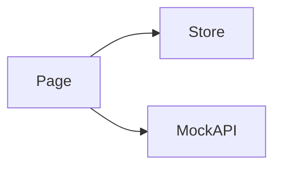

# Insights · Design

> 关注 **HOW**: 在 [requirements.md](./requirements.md) 确认的目标下, 如何在代码中落地。

## 架构概览 · Architecture
TODO



## 路由 · Routes
| Path | Page Component | 说明 |
|---|---|---|
| `/insights` | `InsightsPage` | TODO 列表 |
| `/insights/:id` | `InsightDetailPage` | TODO 详情 (P1) |

注册位置: `src/features/insights/routes.tsx`, 当前仅占位 `ModulePlaceholder`。

## 数据模型 · Data Model
```ts
// TODO
// export interface Insight {
//   id: string;
//   title: string;
//   summary: string;
//   producedBy: { type: "agent" | "workflow" | "user"; refId: string };
//   linkedNodes: string[]; // KG 节点 id
//   createdAt: string;
//   archived: boolean;
// }
```

## Mock API · Endpoints
| Method | Path | Response | 说明 |
|---|---|---|---|
| GET | `/api/insights/list` | `Insight[]` | TODO |
| GET | `/api/insights/:id` | `Insight` | TODO |
| POST | `/api/insights/:id/archive` | `{ ok: true }` | TODO |

注册位置: `src/features/insights/api/mock.ts`。

## 状态管理 · State (Zustand)
```ts
// TODO
interface InsightsState {
  filter: { archived: boolean; source?: "agent" | "workflow" | "user" };
}
```
- 持久化键: `data-agent.insights.filter`(可选)

## 组件分解 · Component Tree
- `InsightsPage`
  - `InsightFilterBar`
  - `InsightList`
  - `InsightCard`
- `InsightDetailPage`
  - `InsightHeader`
  - `LinkedNodes` (反链 KG)

## 交互细节 · Interaction Details
- TODO 卡片点开详情
- TODO 归档操作 (optimistic update)
- TODO 反链点击跳转 `/knowledge-graph?node=:id`

## i18n · Namespaces
- 命名空间: `insights`
- 文件: `src/features/insights/locales/{zh-CN,en-US}.json`
- 关键 key: TODO

## 性能与可观测性 · Performance & Observability
- 列表虚拟化 (条目 ≥ 200)
- TODO

## 开放问题 · Open Questions
- ❓ insight 是否支持评论 / 协作标注
- ❓ 是否提供 RSS / 邮件订阅
