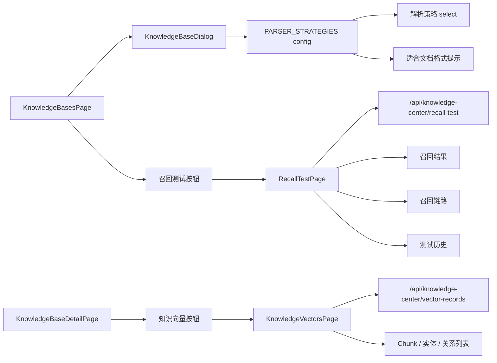

# Knowledge Center · Design

> 关注 **HOW**: 在 [requirements.md](./requirements.md) 确认的目标下, 如何在代码中落地。

## 架构概览 · Architecture
本次改造限定在知识库列表页的表单层。页面继续用 React local state 维护 mock 数据, 解析策略作为 `parser: string` 保存。



## 路由 · Routes
| Path | Page Component | 说明 · Note |
|---|---|---|
| `/knowledge-center/knowledge-bases` | `KnowledgeBasesPage` | 知识库列表、新建和编辑入口 |
| `/knowledge-center/knowledge-bases/recall-test` | `RecallTestPage` | 独立召回测试页, 由知识库列表顶部按钮进入 |
| `/knowledge-center/vectors` | `KnowledgeVectorsPage` | 现有知识向量页, 由知识库详情页顶部“知识向量”按钮进入 |

注册位置: `src/features/knowledge-center/routes.tsx`, 由 `src/app/router.tsx` 组合。
`knowledge-bases/recall-test` 必须注册在 `knowledge-bases/:knowledgeBaseId` 前, 避免被动态详情路由吞掉。不新增召回测试左侧菜单项。

知识向量沿用现有 `/knowledge-center/vectors` 路由, 但原左侧菜单入口需要移除。知识库详情页跳转时通过 `navigate("/knowledge-center/vectors", { state: { knowledgeBaseId, name } })` 传递上下文。向量页读取 `location.state.knowledgeBaseId` 作为默认知识库筛选; 若存在该上下文, 返回按钮跳回 `/knowledge-center/knowledge-bases/:knowledgeBaseId`, 否则返回知识库列表。

## 数据模型 · Data Model
```ts
interface CreateKnowledgeForm {
  name: string;
  description: string;
  access: AccessMode;
  parser: string;
  pdfParser: string;
  chunkSize: string;
  status: KnowledgeStatus;
}

type ParseMode = "auto" | "custom";
type SensitiveContentAction = "mask" | "block";

interface CustomParseConfig {
  chunkSize: number;
  chunkOverlap: number;
  preprocessingEnabled: boolean;
  sensitiveContentAction: SensitiveContentAction;
}

type RecallRetrievalMethod = "vector" | "keyword" | "graph" | "hybrid";

interface RecallTestRequest {
  query: string;
  datasetId: string;
  knowledgeBaseIds: string[];
  method: RecallRetrievalMethod;
}

interface VectorRecord {
  id: string;
  type: "chunk" | "entity" | "relation";
  knowledgeBaseId: string;
  knowledgeBaseName: string;
  collection: string;
  embeddingModel: string;
  dimension: number;
  status: "ready" | "vectorizing" | "failed" | "deleted";
  sourceTitle: string;
  content: string;
  vectorPreview: number[];
  metadata: Record<string, unknown>;
  updatedAt: string;
}
```

## 解析策略配置 · Parser Strategies
在 `KnowledgeBasesPage.tsx` 内维护 `PARSER_STRATEGIES`:

| 解析策略 | 适合文档格式 |
|---|---|
| 自动解析（推荐） | pdf、docx、doc、xlsx、xls、csv、txt、md、html |
| 通用文档 | pdf、docx、doc、pptx、ppt、md、html |
| 表格优先 | xlsx、xls、csv、tsv |
| 扫描件/OCR优先 | pdf、jpg、jpeg、png、tiff、bmp |
| 纯文本优先 | txt、md、log、json、xml、html |
| 问答对 | xlsx、csv、txt、pdf、docx |
| 操作手册 | pdf、docx、doc、html、md |
| 学术论文 | pdf、docx、tex |
| 高级自定义 | pdf、docx、xlsx、xls、csv、txt、md、html、json |

## 交互细节 · Interaction Details
- 新建知识库弹窗默认 `parser` 为“自动解析（推荐）”。
- 编辑知识库弹窗通过现有记录回显 `parser`, 若遇到旧值 `naive 通用文档` 映射为“通用文档”, `qa 问答文档` 映射为“问答对”。
- 解析策略下拉框由 `PARSER_STRATEGIES` 渲染, 下方提示读取当前策略的 `formats`。
- 知识库列表列头显示为“解析策略”, 单元格继续展示 `item.parser`。
- 知识库详情页移除旧“召回测试”按钮和弹窗, 召回测试统一从知识库列表页进入。
- 召回测试页使用“左侧测试设置与历史、右侧结果与链路”的两栏工作台布局。测试设置包含测试问题、测试数据集、多知识库选择和检索方式, 右侧保持召回结果与链路排查视图连续可读。
- 测试数据集固定为“技术文档问答集”“云原生运维问答集”“统计指标问答集”“自定义临时问题”, 默认技术文档问答集。
- 检索方式固定为“向量检索”“关键字检索”“图谱检索”“混合检索”, 默认混合检索。
- 召回结果展示排名、得分、知识库、来源标题、片段内容、记录类型、命中原因。
- 测试历史仅保存在页面 local state, 展示时间、问题、数据集、知识库数量、检索方式和命中数, 点击历史项回填当次设置与结果。
- 知识库详情页顶部展示“知识向量”按钮, 与“知识图谱”入口并列。点击后进入现有知识向量页面, 不新增知识库内的向量子路由。
- 知识向量页顶部展示与知识图谱内页一致的 icon 返回按钮。通过知识库详情页进入时返回原知识库详情页; 直接访问时返回知识库列表。
- 知识向量页保留现有 Chunk / 实体 / 关系三类 Tab、顶部统一搜索、行内查看详情、行内重新向量化、行内删除和详情抽屉；页面不展示知识库选择、集合筛选、模型筛选、状态筛选、批量重新向量化、批量删除、重建索引按钮，也不展示相似度检索面板。
- 知识向量页顶部指标固定为四张卡片: 向量分布、向量重复率、向量方差、聚类数量。向量分布展示总数、Chunk 数、实体数、关系数; 向量重复率展示重复向量数/全部向量数, 重复向量按余弦相似度 > 99.5% 统计; 向量方差用向量到均值向量的平均平方距离表示语义空间分散程度; 聚类数量基于 mock 二维投影近邻连通关系估算主题数量。每张卡片提供可点击叹号, 点击后在卡片内展开指标解释, 再次点击收起。
- 知识向量页在关系后新增“可视化”Tab。该 Tab 使用当前知识库范围内 Chunk、实体、关系向量展示二维 mock 投影散点图; 顶部统一搜索在列表 Tab 中过滤列表, 在可视化 Tab 中定位散点而不裁剪点集。
- 向量可视化参考 Milvus 向量可视化文档中的 t-SNE 散点图样式, 同时参考 TensorBoard Embedding Projector 的点选、缩放、平移和投影视图, 以及 Nomic Atlas Data Maps 的语义地图、颜色图例、筛选联动和点详情形态。
- 向量可视化首版不接真实降维服务, 使用 `vectorPreview` 前 6 维按 PCA、t-SNE、UMAP 三套固定公式映射到二维坐标, 再按 ID 加确定性轻微偏移避免重叠。画布展示浅灰背景、虚线网格、随算法切换的 `PCA1/PCA2`、`TSNE1/TSNE2`、`UMAP1/UMAP2` 坐标轴和 mock 坐标刻度。
- 可视化提供两个下拉框: 降维算法（PCA、t-SNE、UMAP）和着色方式。着色方式默认“按类型着色”, Chunk、实体、关系分别使用不同颜色; “按查询着色”使用绿色 Query、红色 Similar knowledge、蓝色 Other knowledge。按查询着色时, 使用当前选中向量与当前可视化结果内所有记录的 `vectorPreview` 欧氏距离计算 Top 8 相似点。
- 可视化不再展示独立搜索框, 复用页面右上角统一搜索。搜索范围为当前知识库内 Chunk、实体和关系; 匹配优先级为 ID 精确匹配、ID 包含、展示名称包含、内容包含、来源标题包含、metadata 包含。命中后自动选中该点、切换为按查询着色并平移画布让命中点居中; 未命中时展示“未找到匹配向量”, 不清空当前选中点。
- 向量可视化使用原生 SVG 和 React 本地状态实现, 不新增依赖。坐标网格、坐标刻度、坐标轴和散点放在同一 SVG transform 下, 确保滚轮缩放或拖拽平移时坐标与点同步变化。支持点击点后在右侧面板展示 ID、类型、状态、所属知识库、所属文档、来源 Chunk、向量模型、维度、更新时间、内容摘要和 Metadata; 支持滚轮缩放 `0.6` 到 `2.2`、拖拽平移和“重置视图”。
- 可视化顶部提供“健康度分析”按钮。点击后右侧面板从向量详情切换为健康度分析, 再次点击恢复为向量详情。健康度分析展示重复向量、孤立点、向量密度、聚类数量、异常向量、空白内容和超短文本。首版指标由前端 mock 估算: 重复向量基于 `vectorPreview` 指纹, 孤立点和聚类基于二维投影近邻距离, 异常向量合并失败状态、零向量和孤立点, 空白/超短文本基于 `content` 长度判断。
- 知识向量页三类列表使用不同列定义:
  - Chunk 列表: ID、内容、Chunk大小、所属知识库、所属文档、向量模型、向量维度、创建时间、更新时间。
  - 实体列表: ID、实体名称、实体类型、属性、关联关系数、实体描述、所属知识库、所属文档、来源Chunk、向量模型、向量维度、创建时间、更新时间。
  - 关系列表: ID、头实体、尾实体、关系类型、关系描述、所属知识库、所属文档、来源Chunk、向量模型、向量维度、创建时间、更新时间。
- 列表不展示向量值；详情抽屉继续展示完整预览和 Metadata。
- 现有 mock `VectorRecord` 不新增接口字段。页面层从 `metadata`、`sourceTitle`、同知识库 Chunk 记录派生所属文档、来源 Chunk、Chunk 大小、实体类型、关系类型、头实体、尾实体、关联关系数和 mock 创建时间。

## 文档解析设置 · Document Parsing Settings
- 知识库详情页文档列表的“设置解析方法”按钮打开居中弹窗, 替换原行内解析器下拉框。弹窗标题下展示当前文件名, 解析方式使用“自动解析 / 自定义解析”单选框。
- 每条 `KnowledgeDocument` 保存 `parseMode` 与 `customParseConfig`。自动解析在列表显示“自动解析”且分片大小显示“自动”; 自定义解析显示“自定义解析”与实际分片大小。
- 自定义解析的分片大小、分片重叠均使用 Token。默认值分别为 512、50; 分片大小必须为 1–8192 的整数, 分片重叠必须为大于或等于 0 且小于分片大小的整数。
- 文档预处理使用统一总开关且默认关闭。开启后固定覆盖特殊字符清理、敏感内容检测和重复内容去除, 并允许选择“脱敏后入库”或“阻止入库”, 默认脱敏后入库。
- 弹窗使用独立草稿状态。取消、关闭、点击遮罩或 Escape 不回写; 保存时才更新页面 local state。模式切换不清空已保存的自定义配置, 自动模式下即使未完成自定义草稿也可以保存并继续保留上次有效配置。
- 新上传文档默认自动解析。本阶段不新增 API, 不执行真实解析或预处理。

## 召回链路 · Recall Pipeline
| 检索方式 | 步骤 |
|---|---|
| 向量检索 | Query → Query 向量化 → 向量相似度计算 → 检索 Chunks → Rerank TopK → Send LLM → Response |
| 关键字检索 | Query → Query 清洗与分词 → 关键词扩展 → 倒排索引 / BM25 匹配 → 检索 Chunks → Rerank TopK → Send LLM → Response |
| 图谱检索 | Query → 实体识别与意图识别 → 实体链接到图谱节点 → 图谱邻域 / 路径扩展 → 图谱证据片段召回 → Rerank TopK → Send LLM → Response |
| 混合检索 | Query → Query 分析与检索路由 → 并行执行 Query 向量化、关键词分词、实体识别 → 向量相似度计算、BM25 匹配、图谱扩展 → 多路结果合并去重 → 检索 Chunks / 证据聚合 → Rerank TopK → Send LLM → Response |

每个链路步骤展示步骤名、状态、耗时、输入摘要、输出摘要、命中数量或关键指标, 便于排查卡点。

## Mock 接口 · Mock API
`GET /api/knowledge-center/vector-records`

返回: `VectorRecord[]`

知识向量页继续使用现有 mock 记录。列表新增字段只在前端派生, 不调整 mock client 路由和后端契约。

`POST /api/knowledge-center/recall-test`

请求: `RecallTestRequest`

返回:
```ts
interface RecallTestResponse {
  results: RecallTestResult[];
  steps: RecallTraceStep[];
  historyItem: RecallHistoryItem;
}
```

mock 实现复用现有 `vectorRecords`, 支持多知识库过滤。LLM 步骤只返回 mock response, 不调用真实模型。

## 测试策略 · Test Strategy
- 运行 `npm run build`, 覆盖 TypeScript 与 Vite 构建。
- 手动验证新建弹窗默认策略与格式提示。
- 手动逐项切换 9 种解析策略, 验证格式提示随选择更新。
- 手动验证新建保存和编辑保存后列表展示所选解析策略。
- 手动验证知识库列表页顶部“召回测试”进入独立页面, 知识库详情页不再有旧入口。
- 手动验证 4 种检索方式生成不同召回链路, 并且结果、链路、历史可正常展示。
- 手动验证知识库详情页顶部“知识向量”进入向量页, 默认筛选当前知识库。
- 手动验证知识向量页返回按钮: 从详情页进入时返回详情页, 直接访问时返回知识库列表。
- 手动验证 Chunk、实体、关系三个 Tab 的列表字段与需求一致, 横向滚动下所有字段可见。
- 手动验证解析设置弹窗的自动/自定义切换、输入边界、取消不保存、保存回显、配置保留、预处理开关和敏感内容策略。

## 开放问题 · Open Questions
- ❓ 后续真实接口是否需要将策略显示名和提交值拆分, 例如 `auto` / `general` / `qa`。
