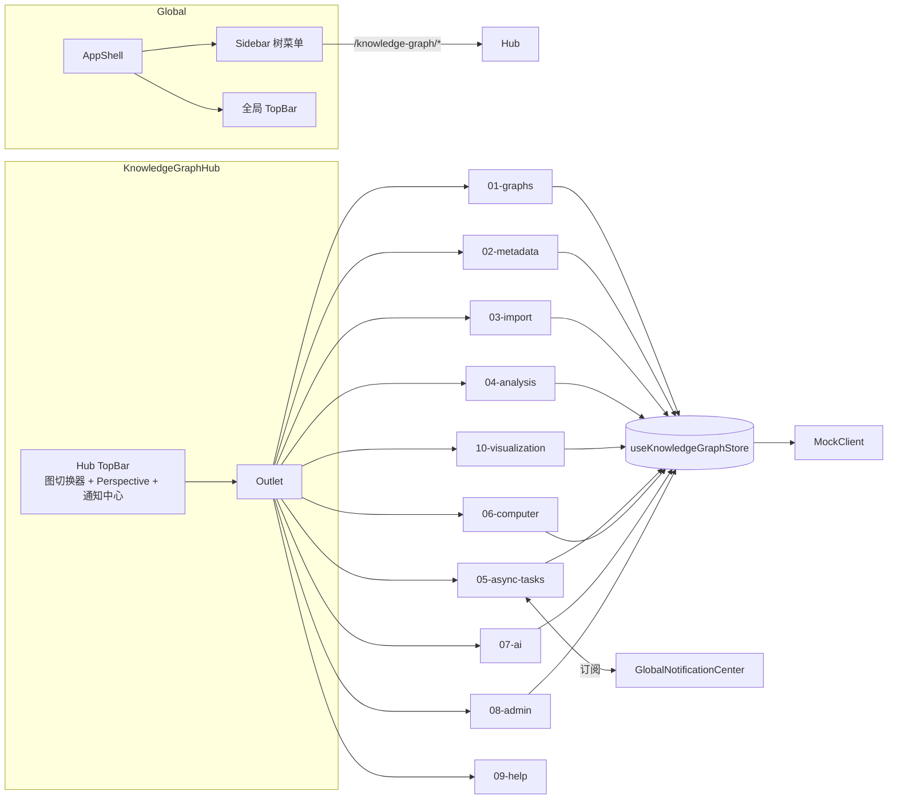

# Knowledge Graph · Design

> 关注 **HOW**: 在 [requirements.md](./requirements.md) 确认的目标下, 如何在代码中落地。子模块细节见 [submodules/](./submodules/)。

## 架构概览 · Architecture



KG hub 自身**不**渲染 inner sub-nav, 导航完全靠左侧全局 Sidebar 树菜单。Hub 只保留: 当前图实例切换器 + Perspective 下拉 + 通知中心入口 + Outlet。

## 视觉方向 · Visual Direction (ADR-0007 落地基准)
**Classic Light SaaS Admin** 派系, 由 `frontend-design` skill 引导后收敛为传统 B2B 后台:

| Token 类 | 值 | 备注 |
|---|---|---|
| 基底色 | 浅灰 `hsl(210 24% 97%)` + 白色面板 | 默认 `:root`, **无** `.dark` 主题 |
| 网格 | 24px 浅灰网格 | 仅图谱/画布区域使用 `bg-grid-paper` |
| 主 accent | Blue `hsl(221 83% 53%)` | active rail / focus / primary CTA |
| 中性色阶 | 冷灰 SaaS neutral | 服务表格扫描和长时间使用 |
| 字体 · UI | Space Grotesk | 现阶段通过 Google Fonts 加载 |
| 字体 · 数据 | IBM Plex Mono | 数字、ID、代码和数据标签 |
| 卡片边框 | 1px 单线 + 轻量 shadow-sm | 标准 SaaS 面板 |
| 圆角 | 8px 上限 | 使用 `rounded-md` / `rounded-sm` |
| 动效 | 80–120ms ease-out, hover 用 vector arrow / underline reveal | 避免缩放与回弹 |
| 图谱画布 | 节点细线圆环(非实心填充), 边单线 + 端点箭头, 高亮路径 cobalt | 与 metadata 样式 token 互通 |
| 必避 | Inter / Roboto / 圆角胶囊 / 紫色渐变 / 阴影堆叠 / 居中对称 hero | AI-slop 黑名单 |

详细 token 表与组件级落地走 `specs/platform/02-design-system.md` 重写(ADR-0007)。

## 路由 · Routes
| Path | Page Component | 说明 · Note |
|---|---|---|
| `/knowledge-graph` | `KnowledgeGraphHub` | 重定向到 `/knowledge-graph/graphs` |
| `/knowledge-graph/graphs` | `GraphsListPage` | 实例卡片列表 |
| `/knowledge-graph/graphs/:id` | `GraphDetailPage` | 默认 "概览" tab(平台扩展 Dashboard) + "明细" tab |
| `/knowledge-graph/metadata` | `MetadataPage` | List / Graph 双模式 |
| `/knowledge-graph/import` | `ImportPage` | Connector 抽象 + 4 步向导 |
| `/knowledge-graph/analysis` | `AnalysisPage` | 三段 layout + 三模式编辑器 |
| `/knowledge-graph/visualization` | `VisualizationPage` | 独立图浏览页 |
| `/knowledge-graph/async-tasks` | `AsyncTasksPage` | 列表 + 详情抽屉 + 订阅 |
| `/knowledge-graph/computer` | `ComputerPage` | 算法目录 + 参数表单 |
| `/knowledge-graph/ai` | `AiPage` | 四块入口 |
| `/knowledge-graph/admin` | `AdminPage` | DangerZone |
| `/knowledge-graph/help` | `HelpPage` | 深链卡片 + 顶部归属 |

注册位置: `src/features/knowledge-graph/routes.tsx`(继续 `import "./api/mock"` 注册 fixture)。

## 组件分层 · Component Tree
- `KnowledgeGraphHub` (Layout: TopBar 图切换器 + Perspective 下拉 + 通知中心 + Outlet, **无 sub-nav**)
  - `pages/graphs/{GraphsListPage,GraphDetailPage}`
  - `pages/metadata/MetadataPage` → `MetadataListEditor` | `MetadataGraphEditor`
  - `pages/import/ImportPage` → `ImportWizard` (Connector 步骤组件按类型动态加载)
  - `pages/analysis/AnalysisPage` → `QueryEditor(三模式 tab)` + `ResultPane(三 tab)` + `HistoryPane` + `EntityDetailDrawer`
  - `pages/visualization/VisualizationPage` → `Canvas` + `QuickActionsToolbar` + `LayoutPicker` + `MiniMap` + `StylePanel` + `EntityDetailDrawer`
  - `pages/async-tasks/AsyncTasksPage` → `TaskList` + `TaskDetailDrawer`
  - `pages/computer/ComputerPage` → `AlgorithmCatalog` + `AlgorithmParamForm`
  - `pages/ai/AiPage` → `NL2QueryPanel` + `GraphRAGPanel` + `KGBuildPanel` + `GraphMLCatalog`
  - `pages/admin/AdminPage` → `DangerZoneList` + `DangerConfirmDialog` + `OperationHistory`
  - `pages/help/HelpPage` → `DeepLinkGrid` + `AttributionBanner`

跨子模块共用: `<EntityDetailDrawer>` / `<GraphCanvas>`(被 metadata Graph 模式、analysis Graph tab、10-visualization 复用) / `<NotificationToast>` / `<GraphInstanceSwitcher>` / `<PerspectiveSwitcher>`。

## 状态 · State (Zustand)
```ts
interface KnowledgeGraphState {
  currentGraphId: string | null;
  activePerspectiveId: string | null;
  selectedNodeId: string | null;
  queryHistory: QueryRecord[];
  metadata: {
    mode: 'list' | 'graph';
    draft: MetadataDraft | null;            // graph 模式累积草稿
  };
  import: {
    activeConnector: 'local' | 'database' | 'api' | null;
    currentJobId: string | null;
  };
  visualization: {
    rootVertexId: string | null;
    expandedSet: Set<string>;
    layout: 'force' | 'hierarchical' | 'circular' | 'radial' | 'grid' | 'dagre';
    layoutSeed: number;
    styleOverrides: StyleRule[];
  };
}
```
- 视图 UI 状态用 React local state(tab 切换 / 输入框 / 抽屉开合)
- 跨页面要保留的状态(currentGraphId / activePerspectiveId / visualization)放 Zustand, 持久化 key `data-agent.knowledge-graph`
- 数据(schema / 查询结果 / 任务列表) 走 mockClient 读取, 不放 Zustand

## i18n · Namespace
- Namespace: `knowledge-graph`
- 文件: `src/features/knowledge-graph/locales/{zh-CN,en-US}.json`
- key 按子模块分组: `graphs.*` / `metadata.*` / `import.*` / `analysis.*` / `visualization.*` / `asyncTasks.*` / `computer.*` / `ai.*` / `admin.*` / `help.*` / `common.*`
- 注册位置: `src/lib/i18n.ts`

## Mock API · Endpoints
所有端点以 `/api/knowledge-graph/<sub>/...` 为前缀, **不**镜像 HugeGraph REST 路径形式(避免造成对 HG 接口的隐式依赖)。完整端点清单见各子模块 spec, 此处只列跨模块入口:

| Method | Path | Response | 子模块 |
|---|---|---|---|
| GET | `/api/knowledge-graph/graphs/list` | `GraphInstance[]` | 01 |
| GET | `/api/knowledge-graph/graphs/:id/overview-stats` | `GraphOverviewStats` | 01 |
| GET | `/api/knowledge-graph/perspectives/list` | `Perspective[]` | 跨模块 |
| GET | `/api/knowledge-graph/async-tasks/subscribe` | SSE `TaskEvent[]` | 05 + 全局通知中心 |

注册位置: `src/features/knowledge-graph/api/mock.ts`(按子模块拆分到 `api/{graphs,metadata,...}.ts`, 在 mock 入口聚合 import)。

## DataSourceConnector 抽象 · Import Connector Interface
03-import 不写三套独立 UI, 走统一接口:

```ts
type ConnectorKind = 'local' | 'database' | 'api';

interface DataSourceConnector {
  kind: ConnectorKind;
  /** 建立 mock 连接, 校验参数 */
  connect(config: unknown): Promise<ConnectResult>;
  /** 前 N 行预览, 供字段映射使用 */
  preview(): Promise<PreviewSample[]>;
  /** 数据源字段列表 */
  schema(): Promise<SourceField[]>;
}

interface ConnectResult { ok: boolean; message?: string; sampleSize?: number; }
interface PreviewSample { row: number; values: Record<string, unknown>; }
interface SourceField { name: string; inferredType: 'string' | 'number' | 'boolean' | 'datetime' | 'json'; nullable: boolean; }
```
字段映射页对所有 Connector 复用同一组件 `<FieldMappingTable>`; 新增 Kafka / S3 / Parquet Connector 只需增加实现, UI 不动。

## Perspective 模型 · Perspectives
```ts
interface Perspective {
  id: string;
  graphId: string;
  name: string;
  description?: string;
  filterRules: FilterRule[];        // 节点 / 边过滤
  styleOverrides: StyleRule[];      // 样式映射
  defaultLayout: LayoutKind;
  savedQueries: SavedQueryRef[];    // 关联查询模板
  createdAt: string;
  updatedAt: string;
}

interface StyleRule {
  target: 'vertex' | 'edge';
  binding: 'label' | 'property' | 'degree';
  mapping: Record<string, { color?: string; size?: number; shape?: string; iconKey?: string }>;
}
```
切换 Perspective 时, 当前页面的过滤 / 样式 / 默认布局应即时刷新, 不需要重新加载图; 全应用 last-active perspective 持久化到 Zustand。

## Fixtures · 演示种子集
为打通"建 schema → 导数据 → 查询 → 看图 → 跑算法"的演示流, design 阶段约定一份跨模块自洽的演示数据:

- **规模**: ~200 顶点 / ~500 边
- **VertexLabel** ≥ 3: `Person` / `Company` / `Product`
- **EdgeLabel** ≥ 4: `works_at` / `invests_in` / `produces` / `collaborates_with`
- **PropertyKey** ≥ 12: name / industry / founded / region / amount / role / startedAt 等
- **Indexes** ≥ 4: 至少覆盖 Person.name / Company.industry / Company.region / Product.name
- **种子任务**: 至少 3 类 mock task(import / OLAP / index-rebuild) 各 ≥ 2 条
- **种子 Perspective** ≥ 2: "Procurement View"(投资关系隐藏) / "Risk View"(高亮多跳路径)
- **文件位置**(spec 描述, 不在本次写入): `src/features/knowledge-graph/api/fixtures/{graph-seed,schema-seed,perspectives-seed,tasks-seed,import-jobs-seed}.json`

约束: 同一份种子被 metadata / analysis / visualization / async-tasks / 06-computer 共享, 演示流必须在 mock 模式下完整跑通(每个子模块的 mock 端点应能返回与种子一致的数据)。

## 跨模块任务移交 · Cross-module Task Handoff
对应 `AC-G-HANDOFF`:

1. `ai.kg-build` / `computer.submit-job` / `import.execute` → 调用 mock 端点返回 `taskId`
2. 调用方页面**不阻塞**, 弹 `<NotificationToast>` 含"前往任务详情"链接(指向 `/knowledge-graph/async-tasks?taskId=<id>`)
3. 任务自动加入 `useAsyncTasksStore.list` 顶部(或 mock 端点 next 次 list 包含)
4. 任务状态变化通过 `useGlobalNotifications().broadcast(taskId, status)` 广播, 各订阅页面收到后刷新本地视图

GlobalNotificationCenter 组件位置: `src/components/layout/NotificationCenter.tsx`(M0 留 shell, M2 实装订阅)。

## 视觉对齐度评审清单 · Visual Alignment Checklist
每个 Hubble 1:1 子模块 spec 须列 ≥ 2 条"视觉对齐 AC"。评审时, 按以下结构维度对照真实 Hubble 界面校对(`https://hugegraph.apache.org/docs/quickstart/hugegraph-hubble/` 或本地 docker), **不**复制具体文案 / 图标 / 截图:

1. 页面区域划分(顶 / 中 / 底 / 左 / 右 / 抽屉) 与 Hubble 同位
2. 主控件类型(按钮位置 / tab 数 / 表格列序 / 抽屉触发) 与 Hubble 等位
3. 流程步骤数 / 步骤次序 与 Hubble 一致
4. 信息层级(标题 / 副标题 / 数据列) 的视觉权重相对关系一致
5. 状态徽标 / 进度指示 / 错误态的呈现位置一致
6. 关键交互(右键菜单 / 双击 / 拖拽) 的触发方式一致

像素 / 文案 / 图标对齐**不**在本评审范围, 由视觉系统 token 与 i18n 独立把控。

## 性能与可观测性 · Performance & Observability
- **首屏目标**: 框架 skeleton < 500ms, 子页面主数据 < 1.2s (mock latency 220ms)
- **代码分割**: 每个子模块路由级 lazy load, 重组件(图渲染 / 代码编辑器) 二级 lazy
- **大图策略**: ≥ 500 节点时 visualization 的部分布局(hierarchical / dagre) 走 Web Worker 或 lazy compute
- **导出**: > 1000 节点的导出走 async-tasks, 不在前端同步处理
- **埋点预留(P2)**: 子模块切换 / 图切换 / Perspective 切换 / 查询执行 / 任务提交 / 节点扩展 / 模式切换

## Apache-2.0 归属 · Attribution
- README.md 顶部完整归属段
- `09-help.md` 页面顶部 banner 短归属字串
- KG hub footer 兜底短归属(若 09-help 未显示)
- ADR / NOTICE 引入第三方代码时再补充

## 开放问题汇总 · Open Questions
- ❓ 图渲染库选型(ADR-0004): 候选 - 由执行阶段评估, 须支持 ≥ 6 种布局 + 自定义样式 token + Mini-map + ≥ 5000 节点性能
- ❓ 代码编辑器(ADR-0003): 须支持 Gremlin / Cypher 语法高亮 + 自动补全 hooks
- ❓ 文件上传(ADR-0005): 须支持大文件分片 + 断点续传 + 进度回调
- ❓ DB Connector 凭证(ADR-0006): mock-only 期与未来真实接入策略分离
- ❓ 视觉方向(ADR-0007): Classic Light SaaS Admin 的字体终选 / 图谱画布节点形态终稿
- ❓ 树菜单与用户自定义(ADR-0008): 用户改 label / 顺序 vs 代码改路由 / 权限的边界
- ❓ Schema Lint / Diff (E9, 02-metadata 开放问题)
- ❓ 节点 / 边注释 / 评论(E9)
- ❓ GraphChat 对话记忆 + 多线程并行(灵感 Memgraph Lab, 07-ai 开放问题)
- ❓ 规则告警 + 案件管理(灵感 Linkurious, 跨 feature)
