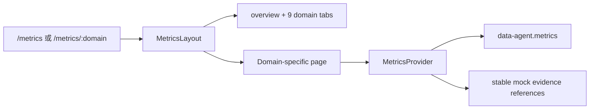

# Metrics · Design

## 架构概览

`metrics` 是一级独立 feature。`MetricsProvider` 通过单一 SQLite scope 保存指标、目标、观测、改进、快照和报告，并按看板分别保存前端时间选择；`MetricsLayout` 只提供产品标题、公共操作和“综合 + 九域”Tab，综合页和九个域页面分别实现业务专属视图及时间筛选。



## 路由

| Path | 页面 | 专属主视图 |
|---|---|---|
| `/metrics` | `OverviewMetricsPage` | 九域比较、KPI 风险与改进优先级 |
| `/metrics/strategy` | `StrategyMetricsPage` | 战略目标树、计划偏差 |
| `/metrics/governance` | `GovernanceMetricsPage` | 会议、治理问题、数据管家 |
| `/metrics/architecture` | `ArchitectureMetricsPage` | 元数据来源、模型评审、集成 |
| `/metrics/assets` | `AssetsMetricsPage` | 目录、使用、估值与权属诊断 |
| `/metrics/standards` | `StandardsMetricsPage` | 落标、术语、口径冲突 |
| `/metrics/quality` | `QualityMetricsPage` | 问题、修复时长、闭环、规则矩阵 |
| `/metrics/security` | `SecurityMetricsPage` | 分类分级、审计证据、分级响应 |
| `/metrics/lifecycle` | `LifecycleMetricsPage` | 归档验证、SLA、退役 |
| `/metrics/application-circulation` | `ApplicationCirculationMetricsPage` | API、满意度、外部数据接入 |

## 页面结构

### 共享区域

1. 标题、重新计算和快照报告入口。
2. “综合看板 + 九域看板”十个路由化 Tab。
3. 不在共享区域放置时间筛选、汇总指标卡或九域状态条。

### 综合看板

- 核心任务：跨域比较九域达标率和健康状态，确定本期管理优先级。
- 主结构：九域量化态势矩阵、核心 KPI 风险清单、本期管理重点。
- 关键决策信息：域内达标率、最差上卷状态、未达标/过期指标、逾期改进、快照与报告数量。
- 布局差异：综合看板不展示单域 KPI 趋势和能力项卡片，而是提供跨域比较与下钻入口。
- 时间筛选：综合看板支持当前、日、周、月，用于选择跨域比较的冻结周期。

### 域内区域

每个页面均包含本域 KPI 概览、趋势、能力项覆盖、证据和改进事项，但主体业务视图不同：

每个看板拥有独立时间选择状态和可选粒度，切换看板不得覆盖其他看板已选周期：

- 战略：当前/月；治理、资产、标准、生命周期：当前/周/月。
- 架构、质量、安全、应用流通：当前/日/周/月。

- 战略：目标完成进度和计划/实际偏差。
- 治理：有效会议、问题闭环漏斗、管家覆盖。
- 架构：元数据采集来源、模型首次评审、集成状态。
- 资产：目录完整、近 90 天使用、可比资产估值。
- 标准：关键对象落标、术语覆盖、跨系统口径冲突。
- 标准页在三项核心 KPI 下按业务术语、主数据、参考数据、数据元标准、指标字典和跨能力版本迁移组织诊断，不把所有指标铺成同构卡片；主视图使用落标状态分布、标准版本迁移队列和指标口径组冲突对比解释风险。
- 质量：确认问题、修复时长分布、规则需求覆盖。
- 安全：数据项分类、审计来源完整性、S1–S4 响应。
- 生命周期：归档批次、恢复验证、数据提供方 SLA。
- 应用流通：调用结果、满意度样本、外部数据接入计划。

## 数据模型

```ts
type DomainKey = "strategy" | "governance" | "architecture" | "assets" |
  "standards" | "quality" | "security" | "lifecycle" | "application";
type MetricStatus = "met" | "warning" | "unmet" | "no-data" | "not-applicable";
type FreshnessStatus = "fresh" | "expiring" | "expired";
type EvaluationDirection = "higher" | "lower" | "range" | "trend";

interface MetricDefinition {
  id: string;
  domain: DomainKey;
  capabilityIds: string[];
  name: string;
  definition: string;
  formula: string;
  direction: EvaluationDirection;
  core: boolean;
  sourceMode: "automatic" | "manual";
}

interface MetricObservation {
  id: string;
  metricId: string;
  period: string;
  value: number | null;
  unit: string;
  status: MetricStatus;
  freshness: FreshnessStatus;
  sourceTime: string;
  targetVersionId: string;
  evidenceRefs: string[];
}
```

`MetricsState` 还包含 `targetVersions`、`improvements`、`snapshots`、`reports`、`operationLog` 和九域专属 mock facts。

数据标准来源事实使用稳定契约而非复制标准正文：

```ts
interface StandardMetricFactRef {
  metricId: string;
  period: string;
  value: number | null;
  numerator?: number;
  denominator?: number;
  breakdown: Record<string, number>;
  standardVersionIds: string[];
  sourceFactRefs: string[];
  evidenceRefs: string[];
  sourceTime: string;
  automationStatus?: "active" | "paused" | "manual-review";
}
```

目标 `data-standard` feature 权威维护标准、版本、稽核批次、AI 判定和来源事实；`data-agent.metrics` 权威维护目标版本、观测、快照、趋势、报告和改进事项。两者只通过稳定 ID 和证据引用关联，不直接 import feature。

## 状态与计算

- SQLite scope：`data-agent.metrics`。
- 核心 KPI 每日重新计算；原型以“重新计算”操作和预置日更记录模拟调度语义。
- 低频来源沿用最近有效值时保留原始数据时间，新鲜度独立计算。
- 越高、越低、区间和趋势四类指标使用明确规则计算业务状态。
- 趋势类处于控制区间时为正常，越界后为预警或异常，并参与透明达标率。
- 能力域按最差状态上卷；数据异常单独呈现，不进入达标率分母。
- 数据标准核心落标率中，失败与未知留在分母，不适用、退役和归档排除；指标口径一致率以一致和受控变体为分子，以一致、受控变体、冲突和未知为分母。
- 历史标准域快照同时冻结当期标准版本和目标版本，不使用当前版本重新计算。

## 交互

- Tab 使用链接，支持键盘、刷新和浏览器前进后退。
- 手工指标可打开填报弹窗，证据引用必填，保存直接生效。
- 指标详情可调整组织目标，生成新目标版本。
- 风险行可创建改进事项；重复未关闭事项被阻止。
- 改进事项填写处理结果和效果证据后直接关闭。
- 快照/报告弹窗展示日、周、月版本和季度报告；仅模拟导出。

## 组件分解

- `MetricsProvider`
- `MetricsLayout`
  - `GlobalSummary`
  - `TimeRangeControl`
  - `DomainStatusStrip`
  - `DomainTabs`
  - `Outlet`
- `OverviewMetricsPage`
  - 九域量化态势
  - 跨域 KPI 风险清单
  - 改进优先级
- 九个 `*MetricsPage`
  - 域专属业务视图
  - `MetricCards`
  - `MetricLedger`
  - `CapabilityCoverage`
  - `ImprovementPanel`
- `MetricFormDialog` / `ImprovementDialog` / `SnapshotReportDialog`

## 可访问性与反馈

- 所有状态同时展示文字、图标和颜色。
- Tab 使用 `aria-current`，SVG 图表提供 `role="img"` 和说明文本。
- 表格在窄屏横向滚动，按钮可键盘操作。
- SQLite 加载和错误使用共享 `InlineNotice`。

## 性能

- 首期仅 25 个核心 KPI、33 个能力项和有限历史 mock，无需虚拟列表。
- 图表使用本地 SVG，不新增图表依赖。
- 页面只读取一个 SQLite state，避免十个 Tab 各自发起持久化读写。
