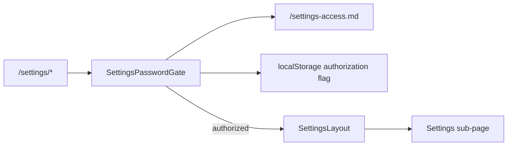

# Settings · Design

> 关注 **HOW**: 在 [requirements.md](./requirements.md) 确认的目标下, 如何在代码中落地。

## 架构概览 · Architecture
`SettingsPasswordGate` 包裹现有 `SettingsLayout`, 在路由树的共同入口统一拦截 Sidebar 导航和直接 URL 访问。门禁从公开 Markdown 读取密码, 验证成功后才渲染设置布局。



> 该门禁不是安全鉴权。Markdown 位于 `public/`, 用户可以直接访问并查看密码; 设计目标仅是减少普通用户误入系统设置。

## 路由 · Routes
| Path | Page Component | 说明 |
|---|---|---|
| `/settings` | `SettingsLayout` | 多 tab 入口, 默认重定向 `/settings/preferences` |
| `/settings/preferences` | `PreferencesPage` | 个人偏好(语言 / 通知) |
| `/settings/menu` | `MenuCustomizerPage` | **菜单自定义(P1, 本期重点)** |
| `/settings/users` | `UsersPage` | 用户与角色 (P1) |
| `/settings/permissions` | `PermissionsPage` | 权限策略 (P1) |
| `/settings/audit` | `AuditPage` | 审计日志 (P1) |
| `/settings/flags` | `FlagsPage` | 功能开关 (P2) |

注册位置: `src/features/settings/routes.tsx`; `SettingsPasswordGate` 作为 `/settings` 路由元素, 内部授权后渲染 `SettingsLayout`。

## 设置访问门禁 · Settings Access Gate
- 密码文件: `public/settings-access.md`, 使用单一、明确的 `password: <value>` 字段。
- 加载: `SettingsPasswordGate` 首次需要验证时通过 `fetch` 请求 `${import.meta.env.BASE_URL}settings-access.md`, 以兼容 GitHub Pages basename。
- 解析: 仅接受非空 `password:` 字段; 加载或格式错误时保持锁定, 显示错误和重试操作。
- 验证: 表单提交时比较输入值与解析结果; 错误密码显示行内错误, 不渲染 `<SettingsLayout />`。
- 持久化: 验证成功后写入 `localStorage` key `data-agent.settings-access`; 后续访问检测到授权标记时直接渲染设置内容。
- 范围: 门禁覆盖 `/settings` 及其全部子路由, 不在 Sidebar 点击事件中重复实现。
- 明文约束: 密码值不得出现在 TypeScript、TSX、locale 或 spec 示例中; 只存在于实际 Markdown 密码文件。

### 状态与错误
- `loading`: 正在读取 Markdown, 禁止提交。
- `locked`: 显示密码输入表单。
- `authorized`: 渲染现有设置布局和子路由。
- `loadError`: 拒绝访问, 显示可重试提示。
- 输入框使用 `type="password"`, 表单可通过 Enter 提交, 错误提示通过 `aria-live` 暴露给辅助技术。

## 数据模型 · Data Model
```ts
export interface User { id: string; name: string; email: string; roles: string[]; }
export interface Role { id: string; name: string; permissions: string[]; }
export interface AuditEvent { id: string; actor: string; action: string; target: string; at: string; }
export interface FeatureFlag { key: string; enabled: boolean; description?: string; }

// 菜单自定义 · Menu Customization (P1 本期重点)
export interface MenuNode {
  id: string;                    // 'kg' / 'kg.graphs' 稳定 key, 不可改
  builtinRouteKey?: string;       // 与代码绑定的内置路由 key; customGroup 时为 undefined
  label: { 'zh-CN': string; 'en-US': string };
  icon?: string;                  // lucide icon key
  children?: MenuNode[];
  hidden?: boolean;
  customGroup?: boolean;          // true = 用户自建分组(无路由)
}

export interface MenuConfig {
  version: number;                 // schema 版本, 后续迁移用
  root: MenuNode[];                // 树根, 通常含 'Workspace' / 'Platform' 两个内置分组
  updatedAt: string;
}
```

约束:
- `builtinRouteKey` 由代码侧 `MenuRegistry` 注册, 用户不可编辑或删除对应节点(只能 `hidden: true`)
- 任何代码侧的 sub-nav / breadcrumb / programmatic navigation 必须**只用 `builtinRouteKey`**, 不用用户 `label`
- 切换语言时按 `label[currentLocale]` 渲染

## Mock API · Endpoints
| Method | Path | Response | 说明 |
|---|---|---|---|
| GET | `/api/settings/users` | `User[]` | 用户列表 |
| GET | `/api/settings/roles` | `Role[]` | 角色与权限 |
| GET | `/api/settings/audit` | `AuditEvent[]` | 审计日志 |
| GET | `/api/settings/flags` | `FeatureFlag[]` | 功能开关 |
| GET | `/api/settings/menu/get` | `MenuConfig` | 取菜单配置(默认 + 用户覆盖合并) |
| POST | `/api/settings/menu/save` | `{ ok: boolean }` | 保存菜单配置 (body: `MenuConfig`) |
| POST | `/api/settings/menu/reset` | `MenuConfig` | 重置为默认结构 |
| POST | `/api/settings/menu/validate` | `{ ok: boolean; issues?: string[] }` | 校验配置(builtinRouteKey 完整性 / 循环引用) |

注册位置: `src/features/settings/api/mock.ts`。

## 状态管理 · State (Zustand)
- 偏好设置直接复用全局 `useLocaleStore` / `useUIStore`, **不在本模块再起 store**
- 子页面内部 state 用 React local state
- **菜单自定义状态**: 新增 `useMenuStore`(持久化 key `data-agent.menu`), 字段:
  ```ts
  interface MenuStoreState {
    config: MenuConfig;                  // 当前生效配置
    draft: MenuConfig | null;            // 编辑中的草稿
    setDraft: (config: MenuConfig) => void;
    commitDraft: () => Promise<void>;     // 调用 /api/settings/menu/save
    resetDraft: () => void;
    resetToDefault: () => Promise<void>;
  }
  ```
- `Sidebar.tsx` 读取 `useMenuStore.config` 渲染, 不直接拉 mock
- 当前精简分支在 `normalizeMenuConfig` 统一应用菜单白名单，因此默认配置和旧浏览器中的 `data-agent.menu` 都只保留“知识中心 → 知识库 / 分析报表”。

## 组件分解 · Component Tree
- `SettingsLayout` (左侧 sub-nav + outlet)
  - `PreferencesPage`
  - `MenuCustomizerPage` (P1 本期重点)
    - `MenuTreeEditor` (可拖拽树形组件)
      - 节点拖拽改顺序 / 嵌套
      - 行内重命名(zh-CN + en-US 双输入框)
      - "隐藏"切换
      - "添加自定义分组"按钮
    - `MenuPreviewPanel` (右侧实时预览左侧 Sidebar 渲染效果)
    - `MenuToolbar` (撤销 / 重做 / 重置为默认 / 保存)
  - `UsersPage`
  - `PermissionsPage`
  - `AuditPage`
  - `FlagsPage`

### MenuCustomizer 交互细节
- **拖拽**: 用 HTML5 drag-drop API; 拖拽中显示插入指示线
- **撤销 / 重做**: 维护 `useMenuStore.draft` 的本地历史栈(P2 可放后续)
- **校验**: 保存前调用 `/api/settings/menu/validate` 防止循环引用; 失败给行内提示
- **预览**: `MenuPreviewPanel` 复用 `Sidebar` 组件渲染 `draft`(若有) 否则 `config`
- **a11y**: 树节点可键盘操作(↑↓ 移焦点, Space 切换 hidden, Enter 重命名, ←→ 折叠展开)

## 交互细节 · Interaction Details
- 偏好修改 optimistic, 立即生效
- 用户表格按 name / email 搜索
- 审计日志按 actor / action / 时间范围过滤
- 未授权进入任意设置路由时, 页面主体显示居中的门禁卡片; 验证成功后保持当前 URL 并原位展示对应设置子页

## 验证策略 · Verification
- 仓库当前未安装自动化测试框架, 不新增 `test` script。
- 通过 `npm run typecheck`, `npm run lint`, `npm run build` 验证静态质量和构建。
- 浏览器验证错误密码、正确密码、直接访问子路由、刷新、关闭后重新打开浏览器、Markdown 加载失败六条路径。

## i18n · Namespaces
- 命名空间: `settings`
- 文件: `src/features/settings/locales/{zh-CN,en-US}.json`
- 关键 key: TODO

## 性能与可观测性 · Performance & Observability
- 审计日志虚拟化或分页
- TODO

## 开放问题 · Open Questions
- ❓ 偏好是否包含暗/亮主题切换 (当前强制 dark)
- ❓ 审计日志的查询粒度 (天 / 小时 / 分钟)
