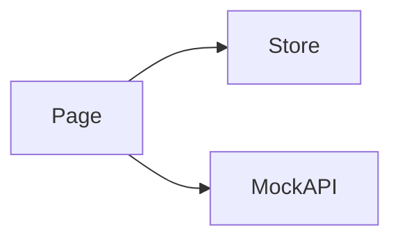

# Workflows · Design

> 关注 **HOW**: 在 [requirements.md](./requirements.md) 确认的目标下, 如何在代码中落地。

## 架构概览 · Architecture
TODO



## 路由 · Routes
| Path | Page Component | 说明 |
|---|---|---|
| `/workflow` | `WorkflowListPage` | TODO 流水线列表 |
| `/workflow/:id` | `WorkflowDetailPage` | TODO 编辑/查看 (P1) |
| `/workflow/:id/runs/:runId` | `WorkflowRunPage` | TODO 运行回放 (P2) |

注册位置: `src/features/workflow/routes.tsx`, 当前仅占位 `ModulePlaceholder`。

## 数据模型 · Data Model
```ts
// TODO
// export interface Workflow {
//   id: string;
//   name: string;
//   nodes: WorkflowNode[];
//   edges: WorkflowEdge[];
//   schedule?: string; // cron
// }
// export interface WorkflowNode { id: string; type: "agent" | "io" | "branch"; refId: string; }
// export interface WorkflowEdge { from: string; to: string; }
```

## Mock API · Endpoints
| Method | Path | Response | 说明 |
|---|---|---|---|
| GET | `/api/workflow/list` | `Workflow[]` | TODO |
| GET | `/api/workflow/:id` | `Workflow` | TODO |
| POST | `/api/workflow/:id/run` | `{ runId: string }` | TODO |

注册位置: `src/features/workflow/api/mock.ts`。

## 状态管理 · State (Zustand)
```ts
// TODO
interface WorkflowState {
  selectedWorkflowId: string | null;
  editingDraft: Workflow | null;
}
```
- 持久化键: 可选 `data-agent.workflow.draft` (草稿)

## 组件分解 · Component Tree
- `WorkflowListPage`
- `WorkflowDetailPage`
  - `WorkflowCanvas` (DAG 渲染)
  - `WorkflowSidebar` (节点配置)
- `WorkflowRunPage`
  - `RunTimeline`
  - `RunLogStream`

## 交互细节 · Interaction Details
- TODO 拖拽节点 / 连线
- TODO 节点配置面板
- TODO 触发后实时状态高亮

## i18n · Namespaces
- 命名空间: `workflow`
- 文件: `src/features/workflow/locales/{zh-CN,en-US}.json`
- 关键 key: TODO

## 性能与可观测性 · Performance & Observability
- DAG 节点数 ≤ 100 时流畅度目标
- TODO

## 开放问题 · Open Questions
- ❓ canvas 库与 KG 模块是否共用
- ❓ 草稿是否需要服务端同步 (跨设备)
